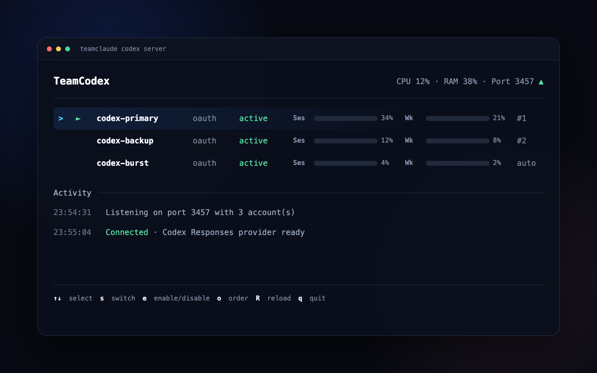
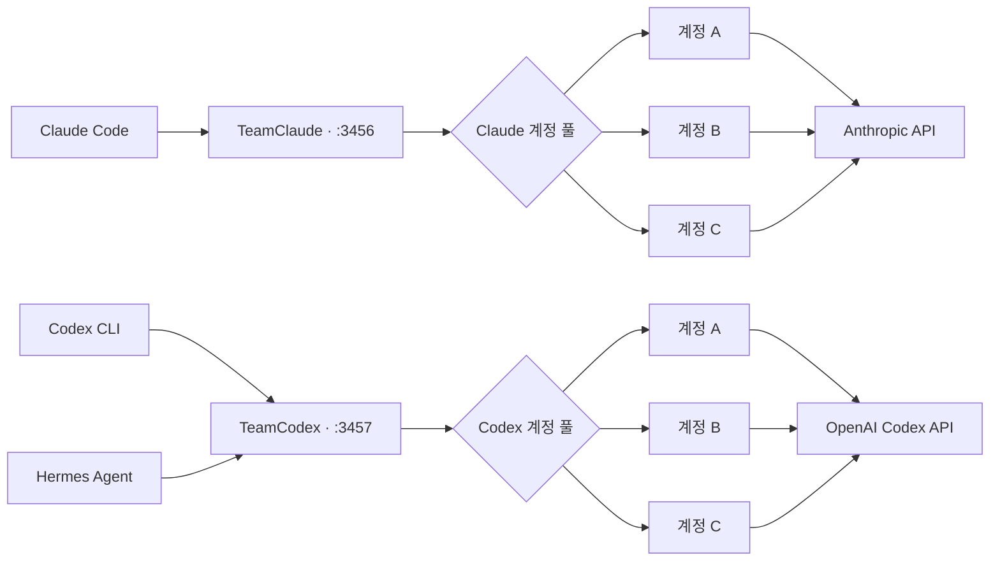

<p align="center">
  <a href="README.md">English</a> ·
  <strong>한국어</strong> ·
  <a href="README.zh-CN.md">简体中文</a>
</p>

<p align="center">
  
</p>

<h1 align="center">TeamClaude · TeamCodex</h1>

<p align="center">
  <strong>하나의 로컬 프록시. 모든 코딩 계정. 끊기지 않는 세션.</strong>
</p>

<p align="center">
  Claude Code와 OpenAI Codex CLI를 각각 독립된 다계정 풀로 실행하세요.<br>
  사용량 기반 라우팅, 즉시 장애 전환, 실시간 터미널 대시보드를 제공합니다.
</p>

<p align="center">
  
  
  
  <a href="LICENSE"></a>
</p>

<p align="center">
  <a href="#빠른-시작"><strong>빠른 시작</strong></a> ·
  <a href="#codex-다계정-설정"><strong>Codex 설정</strong></a> ·
  <a href="#실시간-대시보드"><strong>대시보드</strong></a> ·
  <a href="#작동-방식"><strong>아키텍처</strong></a>
</p>

> [!NOTE]
> Claude와 Codex는 설정 파일, 포트, 계정 풀을 각각 따로 사용합니다. 두 프록시를 동시에 실행할 수 있으며 Codex CLI와 Hermes Agent는 항상 같은 로컬 주소로 접속합니다.

## 설치

```bash
npm i -g teamcodex

teamcodex import          # 기존 클로드 코드 로그인 가져오기
teamcodex codex import    # 기존 ~/.codex/auth.json 가져오기
teamcodex server          # 프록시 시작 후 `teamcodex run`
```

`teamcodex`와 `teamclaude` 두 명령이 함께 설치되고 동작은 같습니다.

## 이용약관에 문제가 없나요?

없습니다. 이 도구는 계정을 여러 사람이 나눠 쓰거나, 재판매하거나, 남에게 중계하지 않습니다.

**본인이 가진 계정**을 **본인 머신에서** 순환시킬 뿐입니다. 손으로 로그인을 갈아끼우는
동작에서 수동 재로그인만 없앤 것이고, 요청마다 그 계정의 OAuth 토큰이 그대로 실립니다.
크리덴셜은 머신 밖으로 나가지 않습니다.

쿼터를 늘려주지도, 한도를 우회하지도 않습니다. 이미 결제한 쿼터가 그냥 소멸하는 것을
막아줄 뿐입니다.

팀이라면 각자 자기 구독으로 인증합니다. 여러 사람이 한 좌석을 나눠 쓰는 용도는 지원하지
않으며, 벤더가 이런 유형의 도구를 금지한다고 밝히면 그에 맞춰 기능을 조정하거나 프로젝트를
정리합니다.

## 원본 프로젝트와의 관계

포크 계보는 [KarpelesLab/teamclaude](https://github.com/KarpelesLab/teamclaude) →
[jung-wan-kim/teamclaude](https://github.com/jung-wan-kim/teamclaude) → 이 저장소입니다.
페이지 상단의 포크 뱃지는 바로 위 부모만 표시하기 때문에 원저자가 아니라 jung-wan-kim으로
보입니다.

[KarpelesLab/teamclaude](https://github.com/KarpelesLab/teamclaude)에서 갈라져 나왔습니다.
원본은 클로드 쪽 구현이 탄탄하고 그것만으로도 충분히 좋은 프로젝트입니다. 이 포크는 원본이
다루지 않는 **Codex(ChatGPT OAuth) 계정 풀링**이 필요해서 다른 방향으로 갔고, 모델 폴백
체인과 네트워크 단위 페일오버를 추가했습니다. 반대로 원본에만 있는 기능도 있으니 환경에
맞는 쪽을 고르시면 됩니다.

## 실시간 대시보드

<p align="center">
  
</p>

<p align="center"><sub>민감한 계정 정보를 제거한 데모 데이터로 렌더링한 실제 TeamCodex TUI 구성입니다.</sub></p>

## 왜 필요한가요?

AI 코딩 구독은 계정마다 세션 한도와 주간 한도가 따로 존재합니다. 한 계정의
사용량이 끝났다는 이유로 장시간 실행 중인 터미널까지 중단될 필요는 없습니다.
TeamClaude와 TeamCodex는 클라이언트가 항상 동일한 로컬 주소를 사용하도록
유지하면서, 새 요청을 가장 적합한 계정으로 자동 전환합니다.

<table>
  <tr>
    <td width="50%">
      <strong>⚡ 끊김 없는 장애 전환</strong><br>
      사용량, 요청 제한, 네트워크, upstream 장애가 발생하면 클라이언트 명령을 바꾸지 않고 다른 계정으로 전환합니다.
    </td>
    <td width="50%">
      <strong>🧭 사용량 기반 라우팅</strong><br>
      주간 한도가 가장 먼저 초기화되는 계정을 우선 사용해 소멸 예정인 할당량을 낭비하지 않습니다.
    </td>
  </tr>
  <tr>
    <td width="50%">
      <strong>🧠 캐시 친화적 연결 유지</strong><br>
      연속된 대화는 같은 계정에 유지하고, 동시 요청이 한도를 넘을 때만 다른 계정으로 분산합니다.
    </td>
    <td width="50%">
      <strong>🖥️ 사람이 직접 제어 가능</strong><br>
      TUI에서 사용량 확인, 계정 전환, 비활성화, 우선순위 변경을 바로 수행할 수 있습니다.
    </td>
  </tr>
</table>

## 주요 기능

- **Use-or-lose 우선순위** — 주간 한도 초기화가 가장 가까운 계정을 먼저 사용합니다.
- **Codex 구독 계정 풀** — ChatGPT OAuth 계정을 별도 풀로 관리하고 공식 Codex 사용량 헤더를 추적합니다.
- **429 즉시 장애 전환** — 사용량이 끝난 계정은 잠시 제외하고 다음 계정으로 요청을 재전송합니다.
- **연속성 모드** — 모든 계정이 잠시 제한된 경우 즉시 실패시키지 않고 초기화 시점까지 프록시 내부에서 대기합니다.
- **연결 affinity** — 같은 터미널의 연속 요청을 같은 계정에 유지해 prompt cache를 보존합니다.
- **동시 요청 분산** — 계정별 동시 요청 한도를 넘는 트래픽은 다른 계정으로 자동 분산합니다.
- **모델 fallback** — 전체 계정에서 특정 모델의 사용량이 끝나면 설정된 대체 모델로 전환합니다.
- **실시간 TUI** — 계정 상태, 세션·주간 사용량, 초기화 시간, CPU·RAM을 표시합니다.
- **계정 수동 제어** — enable, disable, switch, priority 순서를 CLI와 TUI에서 변경할 수 있습니다.
- **재시작 후 상태 복원** — 사용량과 throttle 상태를 별도 quota 파일에 저장합니다.
- **Active warm-up** — 실제 요청 형식을 재사용한 최소 요청으로 계정별 사용량을 빠르게 측정합니다.
- **OAuth 자동 갱신** — 만료가 가까운 인증 정보를 갱신하고 안전하게 저장합니다.
- **런타임 의존성 없음** — Node.js 내장 모듈만 사용합니다.

## 빠른 시작

Node.js 18 이상이 필요합니다.

```bash
# 설치
npm install -g github:sangrokjung/teamclaude

# Claude 계정 추가 — 브라우저 OAuth가 열립니다
teamclaude login
teamclaude login

# Claude 프록시 시작
teamclaude server

# 다른 터미널에서 Claude Code 실행
teamclaude run
```

> [!IMPORTANT]
> 프록시가 실행 중이어도 일반 `claude` 명령은 자동으로 프록시를 사용하지 않습니다. 계정 자동 전환을 사용하려면 반드시 `teamclaude run`으로 시작하세요.

기존 Claude Code 로그인 정보를 가져올 수도 있습니다.

```bash
claude /login
teamclaude import
```

## Codex 다계정 설정

Codex는 `~/.config/teamcodex.json`과 기본 포트 `3457`을 사용합니다.
Claude 프록시의 기본 포트는 `3456`이므로 두 서버를 동시에 실행할 수 있습니다.

```bash
# 공식 Codex OAuth를 각각 격리된 CODEX_HOME에서 실행
teamclaude codex login --name codex-pro-1
teamclaude codex login --name codex-pro-2

# Codex 프록시와 대시보드 시작
teamclaude codex server

# 다른 터미널에서 Codex CLI 실행
teamclaude codex run

# 비대화형 실행
teamclaude codex run -- exec "summarize this repository"
```

현재 공식 Codex CLI에 로그인된 계정을 가져올 수도 있습니다.

```bash
codex login
teamclaude codex import --name codex-pro-1
```

`teamclaude codex login` 방식이 권장됩니다. 이 방식은 임시 `CODEX_HOME`에서
로그인을 수행하므로 TeamCodex와 일반 `~/.codex/auth.json`이 동일한 refresh
token을 서로 갱신하며 충돌하지 않습니다.

### Codex 계정 제어

```bash
teamclaude codex status
teamclaude codex accounts
teamclaude codex disable codex-pro-1
teamclaude codex enable codex-pro-1
teamclaude codex priority codex-pro-2 0
teamclaude codex restart
```

## Hermes Agent 연결

TeamCodex를 실행한 뒤 Hermes의 Codex provider가 로컬 프록시를 사용하도록
설정합니다.

```yaml
# ~/.hermes/config.yaml
model:
  default: gpt-5.6-sol
  provider: openai-codex
  base_url: http://127.0.0.1:3457
```

Hermes의 credential pool에 `openai-codex` 항목이 있다면 각 항목의
`base_url`도 동일하게 설정하세요. 설정 변경 후 Hermes gateway를 재시작합니다.
Hermes는 하나의 고정 주소만 사용하고, 실제 계정 선택·갱신·전환은 TeamCodex가
담당합니다.

## 계정 추가

### OAuth 로그인

```bash
teamclaude login
```

### Claude Code에서 가져오기

```bash
teamclaude import
teamclaude import --name work
```

### API key 계정

```bash
teamclaude api --name production
```

## 서버와 대시보드

```bash
teamclaude server
teamclaude status
teamclaude accounts
teamclaude stop
teamclaude restart
```

TTY에서 `teamclaude server` 또는 `teamclaude codex server`를 실행하면
전체 화면 대시보드가 열립니다.

| 키 | 동작 |
|---|---|
| `↑` / `↓` | 계정 선택 |
| `s` | 선택 계정으로 전환 |
| `e` | 선택 계정 활성화/비활성화 |
| `o` | 우선순위 이동 모드 |
| `a` | 전체 우선순위를 자동 모드로 초기화 |
| `c` | 선택 계정의 고정 우선순위 해제 |
| `d` | 계정 삭제 |
| `R` | 설정 다시 읽기 및 사용량 재측정 |
| `q` | 종료 |

## 기본 설정

Claude 설정 파일은 `~/.config/teamclaude.json`, Codex 설정 파일은
`~/.config/teamcodex.json`입니다. 실제 파일은 권한 `0600`으로 저장됩니다.

```json
{
  "proxy": {
    "host": "127.0.0.1",
    "port": 3456
  },
  "upstream": "https://api.anthropic.com",
  "switchThreshold": 0.98,
  "reevalIntervalMs": 300000,
  "maxConcurrentPerAccount": 3,
  "sessionAffinity": true,
  "continuityMode": true,
  "activeWarmup": true,
  "accounts": []
}
```

| 설정 | 설명 |
|---|---|
| `switchThreshold` | 계정을 가득 찬 것으로 판단하는 사용률 |
| `reevalIntervalMs` | sticky 계정의 우선순위 재평가 간격 |
| `maxConcurrentPerAccount` | 계정 하나의 동시 upstream 요청 수 |
| `sessionAffinity` | 같은 연결을 기존 계정에 유지 |
| `continuityMode` | 전체 제한 시 429 대신 내부 대기 |
| `activeWarmup` | 최소 요청으로 계정 사용량을 선측정 |
| `accounts[].enabled` | `false`이면 계정을 회전에서 제외 |
| `accounts[].priority` | 낮을수록 먼저 사용하는 고정 순위 |
| `modelFallbacks` | 모델별 대체 모델 체인 |

## 작동 방식



1. 클라이언트는 공급자 API 대신 로컬 프록시에 연결합니다.
2. 프록시는 사용 가능한 계정 중 우선순위가 가장 높은 계정을 선택합니다.
3. 만료 5분 이내의 OAuth token은 요청 전에 자동 갱신됩니다.
4. 응답 헤더에서 세션·주간·모델별 사용량과 초기화 시점을 학습합니다.
5. 새로 시작한 서버는 아직 측정되지 않은 계정을 먼저 순회합니다.
6. 사용량 429는 해당 계정을 제외하고 다른 계정으로 즉시 전환합니다.
7. 요청 속도나 동시성 429는 계정을 오염시키지 않고 제한된 횟수만큼 분산합니다.
8. 응답 전 네트워크 오류는 다른 계정으로 재시도합니다.
9. 모든 계정이 제한되면 연속성 모드가 가장 가까운 초기화 시점까지 기다립니다.
10. 일반 사용량 상태는 재시작 후 복원되며 모델별 사용량은 실제 트래픽으로 다시 측정합니다.

## 보안 참고

- 실제 인증 정보가 포함된 설정 파일은 Git에 커밋하지 마세요.
- 원격 클라이언트는 `x-api-key` 인증이 필요합니다.
- 로컬 요청은 기본적으로 localhost에서만 신뢰됩니다.
- 요청 로그를 사용할 때도 인증 정보는 마스킹됩니다.

## 라이선스

MIT
