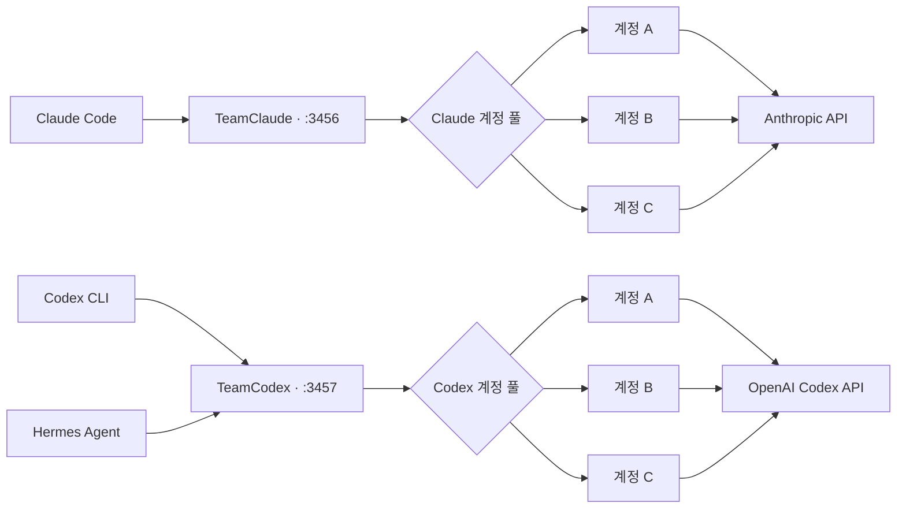

<p align="center">
  <a href="README.md">English</a> ·
  <strong>한국어</strong> ·
  <a href="README.zh-CN.md">简体中文</a>
</p>

<p align="center">
  
</p>

<h1 align="center">TeamClaude · TeamCodex</h1>

<p align="center">
  <strong>하나의 로컬 프록시. 모든 코딩 계정. 끊기지 않는 세션.</strong>
</p>

<p align="center">
  Claude Code와 OpenAI Codex CLI를 각각 독립된 다계정 풀로 실행하세요.<br>
  사용량 기반 라우팅, 즉시 장애 전환, 실시간 터미널 대시보드를 제공합니다.
</p>

<p align="center">
  
  
  
  <a href="LICENSE"></a>
</p>

<p align="center">
  <a href="#빠른-시작"><strong>빠른 시작</strong></a> ·
  <a href="#codex-다계정-설정"><strong>Codex 설정</strong></a> ·
  <a href="#실시간-대시보드"><strong>대시보드</strong></a> ·
  <a href="#작동-방식"><strong>아키텍처</strong></a>
</p>

> [!NOTE]
> Claude와 Codex는 설정 파일, 포트, 계정 풀을 각각 따로 사용합니다. 두 프록시를 동시에 실행할 수 있으며 Codex CLI와 Hermes Agent는 항상 같은 로컬 주소로 접속합니다.

## 설치

```bash
npm i -g teamcodex

teamcodex import          # 기존 클로드 코드 로그인 가져오기
teamcodex codex import    # 기존 ~/.codex/auth.json 가져오기
teamcodex server          # 프록시 시작 후 `teamcodex run`
```

명령은 `teamcodex` 하나입니다. `teamclaude` 바이너리는 일부러 설치하지 않습니다. 같은
이름을 쓰는 원본 패키지와 충돌하지 않기 위해서입니다.

저장소에서 바로 받고 싶다면 `npm i -g github:sangrokjung/teamclaude`도 동작합니다.
이쪽은 항상 기본 브랜치를 따라갑니다.

## 이용약관에 문제가 없나요?

없습니다. 이 도구는 계정을 여러 사람이 나눠 쓰거나, 재판매하거나, 남에게 중계하지 않습니다.

**본인이 가진 계정**을 **본인 머신에서** 순환시킬 뿐입니다. 손으로 로그인을 갈아끼우는
동작에서 수동 재로그인만 없앤 것이고, 요청마다 그 계정의 OAuth 토큰이 그대로 실립니다.
크리덴셜은 로컬에 보관되고, CLI가 원래 보내던 곳인 벤더 API로만 전송됩니다. 제3자는
크리덴셜을 보지 못합니다.

쿼터를 늘려주지도, 한도를 우회하지도 않습니다. 이미 결제한 쿼터가 그냥 소멸하는 것을
막아줄 뿐입니다.

참고로 클로드 코드 자체의 `/extra-usage` 기능이 한도에 걸렸을 때 **본인이 가진 다른 계정**으로
로그인하라고 제안합니다. "내 다른 계정으로 바꿔서 계속 작업하기"는 공식 클라이언트가 먼저
안내하는 동작입니다. 이 도구는 그 전환을 손으로 클릭하는 대신 자동으로 할 뿐입니다.

팀이라면 각자 자기 구독으로 인증합니다. 여러 사람이 한 좌석을 나눠 쓰는 용도는 지원하지
않으며, 벤더가 이런 유형의 도구를 금지한다고 밝히면 그에 맞춰 기능을 조정하거나 프로젝트를
정리합니다.

## 원본 프로젝트와의 관계

포크 계보는 [KarpelesLab/teamclaude](https://github.com/KarpelesLab/teamclaude) →
[jung-wan-kim/teamclaude](https://github.com/jung-wan-kim/teamclaude) → 이 저장소입니다.
페이지 상단의 포크 뱃지는 바로 위 부모만 표시하기 때문에 원저자가 아니라 jung-wan-kim으로
보입니다.

[KarpelesLab/teamclaude](https://github.com/KarpelesLab/teamclaude)에서 갈라져 나왔습니다.
원본은 클로드 쪽 구현이 탄탄하고 그것만으로도 충분히 좋은 프로젝트입니다. 이 포크는 원본이
다루지 않는 **Codex(ChatGPT OAuth) 계정 풀링**이 필요해서 다른 방향으로 갔고, 모델 폴백
체인과 네트워크 단위 페일오버를 추가했습니다. 반대로 원본에만 있는 기능도 있으니 환경에
맞는 쪽을 고르시면 됩니다.

## 실시간 대시보드

<p align="center">
  
</p>

<p align="center"><sub>민감한 계정 정보를 제거한 데모 데이터로 렌더링한 실제 TeamCodex TUI 구성입니다.</sub></p>

## 왜 필요한가요?

AI 코딩 구독은 계정마다 세션 한도와 주간 한도가 따로 존재합니다. 한 계정의
사용량이 끝났다는 이유로 장시간 실행 중인 터미널까지 중단될 필요는 없습니다.
TeamClaude와 TeamCodex는 클라이언트가 항상 동일한 로컬 주소를 사용하도록
유지하면서, 새 요청을 가장 적합한 계정으로 자동 전환합니다.

<table>
  <tr>
    <td width="50%">
      <strong>⚡ 끊김 없는 장애 전환</strong><br>
      사용량, 요청 제한, 네트워크, upstream 장애가 발생하면 클라이언트 명령을 바꾸지 않고 다른 계정으로 전환합니다.
    </td>
    <td width="50%">
      <strong>🧭 사용량 기반 라우팅</strong><br>
      주간 한도가 가장 먼저 초기화되는 계정을 우선 사용해 소멸 예정인 할당량을 낭비하지 않습니다.
    </td>
  </tr>
  <tr>
    <td width="50%">
      <strong>🧠 캐시 친화적 연결 유지</strong><br>
      연속된 대화는 같은 계정에 유지하고, 동시 요청이 한도를 넘을 때만 다른 계정으로 분산합니다.
    </td>
    <td width="50%">
      <strong>🖥️ 사람이 직접 제어 가능</strong><br>
      TUI에서 사용량 확인, 계정 전환, 비활성화, 우선순위 변경을 바로 수행할 수 있습니다.
    </td>
  </tr>
</table>

## 주요 기능

- **Use-or-lose 우선순위** — 주간 한도 초기화가 가장 가까운 계정을 먼저 사용합니다.
- **Codex 구독 계정 풀** — ChatGPT OAuth 계정을 별도 풀로 관리하고 공식 Codex 사용량 헤더를 추적합니다.
- **429 즉시 장애 전환** — 사용량이 끝난 계정은 잠시 제외하고 다음 계정으로 요청을 재전송합니다.
- **구독 해지·인증 오류 분리** — 해지 계정은 결제 종료일까지 추적하고, terminal 인증 증거를 결합해 `subscription-ended`와 일반 인증 오류를 구분합니다. 복구 가능한 오류는 TUI에 UUID 고정 재인증 동작을 표시합니다.
- **자격 증명 비노출 복구 상태** — status, CLI, TUI에는 안전한 오류 이유와 복구 동작만 표시하고 token이나 고정 계정 식별자는 노출하지 않습니다.
- **연속성 모드** — quota 또는 transient/global 429를 기본 15분 deadline 안에서 프록시가 내부 복구하며, probe 간격은 최대 30초입니다.
- **연결 affinity** — 같은 터미널의 연속 요청을 같은 계정에 유지해 prompt cache를 보존합니다.
- **동시 요청 분산** — 계정별 동시 요청 한도를 넘는 트래픽은 다른 계정으로 자동 분산합니다.
- **Fable/Mythos 계정 우선** — 모델별 window가 유효 기간 내이고, 유한한 값으로 측정됐으며, 한도에 도달한(fresh·finite·full) 계정만 그 요청에서 제외합니다. 미측정·만료·사용 가능 계정은 원래 모델로 먼저 시도하고, Opus/Sonnet/Haiku 자격은 유지합니다.
- **모델 fallback** — 캐시에 기록된 general-available 계정이 모두 해당 모델에서 fresh-full이거나, labeled model-tier 429가 실시간으로 eligible 계정 전체에서 확인되면 대체 모델로 전환합니다. Claude Code advisor 요청은 root `tools[]`의 `advisor_*` 항목에 있는 중첩 모델을 기준으로 라우팅하며, fallback도 top-level executor가 아닌 해당 중첩 `model`만 바꿉니다. label 없는 global 429와 단순 local cap·동시성 queue는 모델을 바꾸지 않습니다.
- **실시간 TUI** — 계정 상태, 세션·주간 사용량, 초기화 시간, CPU·RAM을 표시합니다.
- **계정 수동 제어** — enable, disable, switch, priority 순서를 CLI와 TUI에서 변경할 수 있습니다.
- **재시작 후 상태 복원** — 사용량과 throttle 상태를 별도 quota 파일에 저장합니다.
- **Active warm-up** — 실제 요청 형식을 재사용한 최소 요청으로 계정별 사용량을 빠르게 측정합니다.
- **OAuth 자동 갱신** — 만료가 가까운 인증 정보를 갱신하고, 유휴·비활성 계정도 주기 스윕으로 갱신해 refresh 체인이 끊기지 않게 합니다.
- **안전한 내부 재시도 경계** — 재전송해도 안전한 요청만 프록시 안에서 재시도하고, 결과가 불확실한 POST는 숨은 재전송 없이 재시도 가능한 오류로 돌려줍니다.
- **자원 상한** — 요청·응답 버퍼 크기와 대기 시간에 상한을 두어 과부하 상황에서도 프록시가 멈추지 않습니다.
- **런타임 의존성 없음** — Node.js 내장 모듈만 사용합니다.

## 빠른 시작

Node.js 18 이상이 필요합니다.

```bash
# 설치
npm install -g teamcodex

# Claude 계정 추가 — 브라우저 OAuth가 열립니다
teamclaude login
teamclaude login

# Claude 프록시 시작
teamclaude server

# 다른 터미널에서 Claude Code 실행
teamclaude run
```

> [!IMPORTANT]
> 프록시가 실행 중이어도 일반 `claude` 명령은 자동으로 프록시를 사용하지 않습니다. 계정 자동 전환을 사용하려면 반드시 `teamclaude run`으로 시작하세요.
> `teamclaude run`은 로컬 계정이 있고 프록시가 없으면 background supervisor를 자동 기동합니다. 로컬 계정이 없는 터널 전용 머신은 외부 listener를 기다립니다. proxy worker가 비정상 종료되어도 public listener는 유지되고 worker가 자동 재기동됩니다.
> `launchModel` fallback은 일반 한도 기준으로 사용 가능한 계정 전부의 모델별 window가 유효하게 측정된 한도 도달 상태일 때만 적용됩니다. 미측정 또는 만료 window가 하나라도 있으면 조기 downgrade하지 않습니다.

`autoResumeClaude: true`인 `teamclaude run` 세션에서 정확한
`ConnectionRefused` / `ECONNREFUSED` API 오류가 발생하면 launcher는 종료하지 않고
프록시 또는 SSH 터널이 돌아올 때까지 대기한 뒤, 미전송이 확실한 요청만 동일한
session ID에서 `continue`합니다. `ConnectionReset` / `ECONNRESET`과 `Request timed
out`은 원본 요청이 upstream에 도착했을 수 있으므로, 연결 복구 뒤 `--resume
<session-id>`로 세션 UI만 다시 열고 마지막 prompt는 자동 재전송하지 않습니다.
로컬 계정이 없는 터널 전용 머신은 빈 프록시로 포트를 점유하지 않고 터널 복구를
기다립니다.

정확한 구조화 오류 `502 Upstream connection failed after dispatch. Request
was not replayed.`는 별도 안전 경로로 처리합니다. 원본 POST가 upstream에서
실행됐을 수 있으므로 proxy 내부에서는 절대 재전송하지 않습니다. launcher는
proxy 상태를 확인한 뒤 같은 session을 `--resume <session-id>`로 다시 열되
continuation prompt를 보내지 않습니다. 따라서 launcher도 두 번째 inference POST를
만들지 않습니다. safe-reopen 횟수는 일반 재시도 상한과 분리된 전용 budget으로
제한됩니다. Claude가 뒤에 붙이는 `/feedback` 링크와 `Request ID`도 인식하지만
일반 prompt의 유사 문장은 오류로 오탐하지 않습니다. 운영 절차는
[ambiguous-dispatch 502 runbook](docs/runbooks/ambiguous-dispatch-502.md)을 참고하세요.

`teamclaude run`으로 감독되는 세션에서 Claude Code가 정확한 `out of usage
credits` 또는 `usage limit` API 오류를 기록하면 transient overload와 분리해
처리합니다. launcher는 막힌 child를 먼저 종료하고 로컬 proxy 복구를 기다린 뒤,
인증된 `/teamclaude/rotate`가 **다른 account UUID**를 반환한 경우에만 같은 session을
`--resume <session-id> continue`로 재개합니다. 회전 성공을 확인하지 못하면 소진된
같은 계정을 다시 실행하지 않습니다. `overloaded_error`, 일시적 overload, 일반
rate-limit은 이 강제 계정 회전을 호출하지 않습니다.

프록시를 의도적으로 중지하거나 재시작할 때는 별도 터미널을 사용하세요.
supervised Claude 세션 안에서 실행한 `teamclaude stop` / `restart`는 자기 연결을
끊지 않도록 거부됩니다. 이미 직접 `claude`로 시작한 기존 프로세스에는 recovery
launcher를 소급 적용할 수 없으므로 다음 세션부터 `teamclaude run`을 사용하세요.

Anthropic이 한 OAuth 계정에 구조화된 `oauth_not_allowed_for_organization`
403을 반환하면 TeamClaude는 해당 계정만 인증 오류로 격리하고, 완결된 거부
요청을 다른 사용 가능한 계정으로 재전송합니다. 일반 permission 403은 그대로
전달해 계정 풀을 오염시키지 않습니다. 모든 계정이 거부되면 마지막 원본 403을
유지하므로 조직 관리자가 Claude Code 구독 접근을 활성화하거나 운영자가 계정을
다시 import/login할 수 있습니다. 대응 절차는
[subscription-disabled runbook](docs/runbooks/claude-subscription-disabled.md)을 참고하세요.

기존 Claude Code 로그인 정보를 가져올 수도 있습니다.

```bash
claude /login
teamclaude import
```

## Codex 다계정 설정

Codex는 `~/.config/teamcodex.json`과 기본 포트 `3457`을 사용합니다.
Claude 프록시의 기본 포트는 `3456`이므로 두 서버를 동시에 실행할 수 있습니다.

```bash
# 공식 Codex OAuth를 각각 격리된 CODEX_HOME에서 실행
teamclaude codex login --name codex-pro-1
teamclaude codex login --name codex-pro-2

# Codex 프록시와 대시보드 시작
teamclaude codex server

# 다른 터미널에서 Codex CLI 실행
teamclaude codex run

# 비대화형 실행
teamclaude codex run -- exec "summarize this repository"
```

Codex는 TUI 프로세스가 시작될 때 `model_provider`를 고정합니다. 따라서 이미
실행 중인 Codex에서 `source ~/.zshrc`를 실행해도 TeamCodex로 전환되지 않습니다.
문제가 난 TUI를 종료한 뒤 현재 cmux 탭의 정확한 대화를 복구하세요.

```bash
# 최근 세션 선택기 없이 현재 탭에 기록된 Codex checkpoint를 직접 사용
teamcodex codex resume

# SESSION_ID를 알고 있으면 선택기를 완전히 우회
teamcodex codex resume SESSION_ID
```

ID를 생략한 명령은 cmux를 사용할 수 없거나 현재 탭에 신뢰할 수 있는 Codex
resume binding이 없으면 추측하지 않고 실패합니다. 새 세션은
`teamcodex codex run`으로 시작하세요. cmux가 정확한 checkpoint와 TeamCodex
provider 인자를 함께 기록하므로 이후 탭 복원도 프록시 경로를 유지합니다.
`--remote`, `--remote-auth-token-env`, `--oss`, `--local-provider`는 이 경로를
벗어나므로 resume 명령에서 거부합니다.
진단과 레거시 세션 복구는
[Codex provider/session 복구 runbook](docs/runbooks/codex-provider-session-recovery.md)을
참고하세요.

현재 공식 Codex CLI에 로그인된 계정을 가져올 수도 있습니다.

```bash
codex login
teamclaude codex import --name codex-pro-1
```

`teamclaude codex login` 방식이 권장됩니다. 이 방식은 임시 `CODEX_HOME`에서
로그인을 수행하므로 TeamCodex와 일반 `~/.codex/auth.json`이 동일한 refresh
token을 서로 갱신하며 충돌하지 않습니다.

`teamclaude codex run`이 주입하는 provider는 `requires_openai_auth = false`로
동작합니다. 프록시가 풀 계정의 자격 증명을 직접 주입하므로 로컬 Codex CLI에
별도의 ChatGPT 로그인이 없어도 되고, `~/.codex/auth.json`이 만료·폐기되어도
로그인 화면이 `codex run`을 막지 않습니다.

### Codex 계정 제어

```bash
teamcodex codex status
teamcodex codex accounts
teamcodex codex disable codex-pro-1
teamcodex codex enable codex-pro-1
teamcodex codex priority codex-pro-2 0
teamcodex codex restart
```

구독을 해지했지만 결제 기간이 남은 계정은 즉시 삭제하거나 비활성화하지 말고
해지 사실을 기록하세요. 종료일을 아는 경우 `--ends-on`에는 마지막으로 사용할 수
있는 한국 표준시(KST) 날짜를 넣습니다.

```bash
# 종료일을 모르는 해지 계정
teamcodex codex subscription cancel codex-pro-1

# 2026-09-06까지 사용할 수 있는 해지 계정
teamcodex codex subscription cancel codex-pro-2 --ends-on 2026-09-06

# 해지 기록이 잘못됐거나 구독을 다시 시작한 경우
teamcodex codex subscription clear codex-pro-1
```

계정 선택은 설정된 전체 이름·전체 이메일·정확한 이메일 localpart만 허용합니다.
비슷한 계정명 prefix는 선택하지 않으며, 자동화에서는 `--account-uuid`로 선택한
계정의 identity를 함께 고정할 수 있습니다. `status`, `accounts`, TUI와
`/teamclaude/status`는 `해지 예정`, `종료일 경과`, `구독 종료`를 일반
`auth-revoked`·`refresh-failed`와 구분해 표시합니다.

`plan_type=free`, 사용량 조회 실패, 429, 일반 403만으로는 구독 종료라고 판정하지
않습니다. 선언한 종료일이 지났거나 종료일을 모르는 해지 계정에서 terminal 인증
실패까지 관찰됐을 때만 `subscription-ended`로 격리합니다. 이후 유효한 Codex 사용량
조회나 inference 성공이 확인되면 종료 추정을 해제하고 해지 예정 기록으로 되돌립니다.
격리된 계정은 과거 사용량 reset 시각이 지나도 자동으로 rotation에 복귀하지 않습니다.
비스트리밍 inference는 `id`, `object: "response"`, `status: "completed"`를 갖춘
Responses 객체여야 하며, 빈 본문·잘못된 JSON·failed/incomplete HTTP 2xx 본문은 성공
증거가 아닙니다. 스트리밍 inference에서는 `response.completed`만 성공 증거이며,
`response.failed`·`response.incomplete`·`error`·`[DONE]` 단독으로는 종료 계정을
다시 활성화하지 않습니다.

선언이 없어도 프록시가 구독 종료를 스스로 감지합니다. 사용량 폴에서 401/403이
성공(유효한 폴 또는 완료된 inference) 없이 `codexAuthFailureThreshold`(기본 3)회
누적 관측되면 토큰 refresh 1회와 확인 재폴까지 거친 뒤에만 해당 계정을
rotation에서 제외하고, 이후 유효한 사용량 폴이 성공하면 자동으로 복귀시킵니다
(5xx·429·네트워크 오류는 증거로 세지도, 누적을 되돌리지도 않습니다). 이
폴 증거 기반 격리로 가용 계정이 0이 되는 경우에는 circuit breaker가 격리를
보류하므로, 사용량 endpoint만의 장애로 pool 전체가 멈추지 않습니다. 실제 요청
경로의 인증 실패는 마지막 계정도 격리할 수 있습니다.

## Hermes Agent 연결

TeamCodex를 실행한 뒤 Hermes의 Codex provider가 로컬 프록시를 사용하도록
설정합니다.

```yaml
# ~/.hermes/config.yaml
model:
  default: gpt-5.6-sol
  provider: openai-codex
  base_url: http://127.0.0.1:3457
```

Hermes의 credential pool에 `openai-codex` 항목이 있다면 각 항목의
`base_url`도 동일하게 설정하세요. 설정 변경 후 Hermes gateway를 재시작합니다.
Hermes는 하나의 고정 주소만 사용하고, 실제 계정 선택·갱신·전환은 TeamCodex가
담당합니다.

## 계정 추가

### OAuth 로그인

```bash
teamclaude login
```

### Claude Code에서 가져오기

```bash
teamclaude import
teamclaude import --name work
```

### API key 계정

```bash
teamclaude api --name production
```

## 서버와 대시보드

```bash
teamclaude server
teamclaude status
teamclaude accounts
teamclaude stop
teamclaude restart
```

TTY에서 `teamclaude server` 또는 `teamclaude codex server`를 실행하면
전체 화면 대시보드가 열립니다.

| 키 | 동작 |
|---|---|
| `↑` / `↓` | 계정 선택 |
| `s` | 선택 계정으로 전환 |
| `e` | 선택 계정 활성화/비활성화 |
| `o` | 우선순위 이동 모드 |
| `a` | 전체 우선순위를 자동 모드로 초기화 |
| `c` | 선택 계정의 고정 우선순위 해제 |
| `d` | 계정 삭제 |
| `r` | 인증 오류인 선택 계정 재인증 |
| `R` | 설정 다시 읽기 및 사용량 재측정 |
| `q` | 종료 |

### 계정 상태 점검과 재인증

계정 풀을 점검할 때는 CLI를 먼저 사용하세요. `status`는 일부 계정이 `error`여도
나머지 계정 목록을 끝까지 출력합니다.

```bash
teamcodex status       # 실행 중인 프록시의 활성 계정·사용량·오류
teamcodex accounts -v  # 설정된 계정과 OAuth 만료 메타데이터
```

서버가 오류 사유를 제공하면 `auth-revoked`, `refresh-failed`,
`subscription-disabled`, `subscription-ended`처럼 짧은 이유도 함께 표시합니다.
구독 해지 추적은 위 `teamcodex codex subscription` 명령으로 선언한 로컬
metadata이며 ChatGPT 결제 페이지를 자동 조회한 값이 아닙니다. 사용량은 벤더를 즉시 조회한 값이 아니라 프록시가 마지막으로
관찰한 응답 헤더 기준입니다.

프록시가 실행되는 머신에서는 자격 증명이 빠진 동일한 JSON 상태를 조회할 수 있습니다.

```bash
curl -sS http://127.0.0.1:3457/teamclaude/status  # Codex provider
```

응답에는 access token, refresh token, API key, authorization header가 들어가지
않습니다. 공개 status에는 계정 표시 이름과 stable UUID가 모두 빠집니다. identity가
필요한 내부 호출은 localhost에서 proxy API key와 전용 identity header를 모두
제시해야 합니다. 원본 JSON은 공개 채널에 올리지 마세요.

OAuth 계정이 폐기됐거나 refresh grant가 무효라면 계정 회전만으로는 복구할 수
없습니다. 기존 계정을 직접 재인증하세요.

```bash
# Codex 계정 풀: 격리 CODEX_HOME에서 공식 Codex 로그인을 실행
teamcodex codex reauth user@example.com
teamcodex codex reauth user@example.com --account-uuid <account-uuid>
teamcodex codex status

# Anthropic 계정 풀
teamcodex reauth user@example.com
```

이 명령은 로그인 후 반환된 identity가 선택한 UUID와 일치할 때만 해당 계정의 토큰을
교체합니다. Codex는 격리된 `CODEX_HOME`에서 공식 Codex CLI를 실행하고, Anthropic은
OAuth 흐름을 사용합니다. UUID가 없는 구형 항목은 이메일이 일치해야 합니다.
로그인 취소, 프로필 불일치, 비활성 계정, 조직 접근이 차단된 계정은 설정을 바꾸지
않습니다. 실행 중인 프록시는 지원되는 경우 연결을 끊지 않고 다시 읽으며, 지원되지
않으면 CLI가 `teamcodex restart`를 안내합니다.
기존 계정이 자격 증명 파일에서 import된 경우, 재인증 성공 시 오래된
`importFrom` 연결을 제거하므로 reload/restart 뒤에도 새 토큰이 유지됩니다.

TeamClaude/TeamCodex TUI에서는 복구할 수 있는 인증 오류 계정 옆에
**`재인증 필요 [r]`**가 표시됩니다. `r`을 누르면 같은 UUID 고정 절차를 사용하므로
다른 계정의 자격 증명이 선택한 행에 잘못 저장되지 않습니다. 확정된
`subscription-ended`와 `subscription-disabled`에는 재인증을 표시하지 않습니다.

필요하면 Claude Code 로그인을 갱신한 뒤 최신 자격 증명을 가져올 수도 있습니다.

```bash
claude /login
teamcodex import
```

재인증/import는 같은 계정을 중복 생성하지 않고 갱신합니다. Mac 사이에 OAuth
config를 복사하면 회전형 refresh token chain이 서로를 무효화할 수 있으므로 각
머신에서 별도로 로그인하세요.

## 기본 설정

Claude 설정 파일은 `~/.config/teamclaude.json`, Codex 설정 파일은
`~/.config/teamcodex.json`입니다. 실제 파일은 권한 `0600`으로 저장됩니다.

```json
{
  "proxy": {
    "host": "127.0.0.1",
    "port": 3456
  },
  "upstream": "https://api.anthropic.com",
  "switchThreshold": 0.98,
  "reevalIntervalMs": 300000,
  "maxConcurrentPerAccount": 3,
  "sessionAffinity": true,
  "continuityMode": true,
  "continuityMaxWaitMs": 900000,
  "continuityMaxSleepMs": 30000,
  "activeWarmup": true,
  "autoResumeClaude": true,
  "claudeAmbiguousDispatchMaxResumes": 1,
  "codexFallbackOnExhaustion": false,
  "cmuxSessionRescue": false,
  "cmuxSessionRescueIntervalMs": 1000,
  "accounts": []
}
```

| 설정 | 설명 |
|---|---|
| `switchThreshold` | 계정을 가득 찬 것으로 판단하는 사용률 |
| `reevalIntervalMs` | sticky 계정의 우선순위 재평가 간격 |
| `maxConcurrentPerAccount` | 계정 하나의 동시 upstream 요청 수 |
| `sessionAffinity` | 같은 연결을 기존 계정에 유지 |
| `continuityMode` | quota 또는 transient/global 429를 deadline 안에서 내부 복구 |
| `continuityMaxWaitMs` | 연속성 내부 복구의 전체 deadline (기본 `900000` = 15분) |
| `continuityMaxSleepMs` | 연속성 probe 사이의 최대 간격 (기본 `30000` = 30초) |
| `activeWarmup` | 최소 요청으로 계정 사용량을 선측정 |
| `autoResumeClaude` | TeamClaude로 시작한 Claude 세션의 timeout/429/프록시·터널 연결 손실을 같은 세션으로 자동 재개 |
| `claudeAmbiguousDispatchMaxResumes` | 원본 POST 실행 여부가 불확실한 exact 502의 전용 동일 session continuation 횟수. proxy는 원본 POST를 replay하지 않으며, `0`은 비활성, 기본 `1`; 값을 늘리면 중복 inference·과금 위험을 명시적으로 수용 |
| `codexFallbackOnExhaustion` | 대체 Claude 계정이 없거나 전체 일반 quota 소진이 확인된 경우에만 Codex로 인계 |
| `codexResetCredits` | Codex 모드 전용 — 풀이 quota를 다 쓰면 `usage_limit_reached` 429를 돌려주는 대신 계정의 ChatGPT rate-limit reset credit(Codex CLI `/usage`의 "Full reset" 무료 리셋권)을 자동으로 사용합니다. 개수는 `wham/usage` 폴링마다 갱신되고(status의 `quota.codexResetCredits`), 사용은 `/wham/rate-limit-reset-credits/consume`에 새 idempotency key로 POST합니다 (기본 `false`) |
| `codexResetCreditsPolicy` | `fleet`는 서비스 가능한 계정이 하나도 없을 때만 사용(건강한 계정으로의 회전이 항상 우선, dead end당 1장, 리셋권이 많은 계정부터), `account`는 소진 429를 받은 그 계정에서 즉시 사용하고 같은 계정으로 재시도 (기본 `fleet`) |
| `codexResetCreditsCooldownMs` | 계정별 사용 시도 최소 간격(성공·실패 무관) — 리셋이 반영되지 않을 때 리셋권이 연달아 소모되는 것을 막는 상한 (기본 `1800000` = 30분) |
| `codexResetCreditsReserve` | 자동 정책이 남겨 두는 계정별 리셋권 수 (기본 `0`). 로컬 운영 엔드포인트 `POST /teamclaude/codex/reset-credit?account=<name>`(loopback + proxy API key)은 정책·쿨다운·reserve를 무시하고 즉시 사용 |
| `cmuxSessionRescue` | 기존 cmux Claude 세션의 정확한 `Login expired`, 연결 손실, ambiguous-dispatch 502를 감지해 원래 pane을 보존하고 같은 window의 새 비포커스 workspace에서 재개 |
| `cmuxSessionRescueIntervalMs` | 기존 cmux 세션 복구 검사 간격(최소 500ms, 기본 1000ms) |
| `accounts[].enabled` | `false`이면 계정을 회전에서 제외 |
| `accounts[].priority` | 낮을수록 먼저 사용하는 고정 순위 |
| `modelFallbacks` | 모델별 대체 모델 체인. Anthropic 기본값은 `{}`, Codex 기본값은 `gpt-5.6-sol → gpt-5.6-terra` |
| `streamRecovery` | SSE를 이벤트 단위로 중계하고 끊긴 스트림을 재시도 가능한 오류로 마무리 |
| `tokenRefreshIntervalMs` | 유휴 계정 OAuth 갱신 스윕 간격 (`0`=비활성) |

`cmuxSessionRescue`는 소유자 전용 registry/transcript, 정확한 session
selector와 프로세스 시작 시각, 신뢰된 Claude 실행 파일, 실제 cmux
surface→workspace topology가 모두 일치할 때만 동작합니다. 세션별 claim을
디스크에 먼저 기록하므로 supervisor가 재시작되거나 workspace 생성 결과가
불확실해도 같은 세션을 중복 실행하지 않습니다.

버퍼·타임아웃 상한 등 전체 설정 키는 [영문 README](README.md#configuration)를 참조하세요.

Codex의 Sol→Terra fallback은 일반 400에 반응하지 않습니다. ChatGPT OAuth
계정이 Sol을 지원하지 않는다는 exact 400을 반환한 경우에만 해당 계정·모델
조합을 30분 격리하며, 거절된 POST는 재전송하지 않습니다. 모든 eligible
OAuth 계정이 각자의 독립 요청에서 같은 exact 거절을 기록한 뒤 들어온 새
요청만 Terra로 전환합니다. 격리 자체는 해당 OAuth 계정·모델 조합에만 적용되지만,
요청 모델에 유효한 OAuth 격리 기록이 하나라도 생긴 시점부터 이후의 새 Codex 요청도
계정 선택 전에 OAuth 풀로 고정됩니다. mixed pool의 API-key 계정으로 암묵적
replay·failover하지 않으며, 사용할 OAuth 후보와 남은 fallback이 모두 없으면 가장 이른
격리 TTL 만료를 `retry-after`에 담은 429를 즉시 반환합니다. 다른 모델은 계속 사용할 수
있습니다.

## 작동 방식



1. 클라이언트는 공급자 API 대신 로컬 프록시에 연결합니다.
2. 프록시는 사용 가능한 계정 중 우선순위가 가장 높은 계정을 선택합니다.
3. 만료 5분 이내의 OAuth token은 요청 전에 자동 갱신됩니다.
4. 응답 헤더에서 세션·주간·모델별 사용량과 초기화 시점을 학습합니다. 모델별 window는 재시작 때 복원하지 않아 미측정(unknown)으로 시작하며, runtime에서 유효 기간 내의 유한한 측정값이 한도에 도달한(fresh·finite·full) 경우에만 해당 Fable/Mythos 요청에서 그 계정을 제외합니다. 일반 한도 기준으로 사용 가능한 계정 중 미측정·만료·사용 가능 window가 하나라도 있으면 원래 모델을 유지하고, Opus/Sonnet/Haiku 자격은 바뀌지 않습니다.
5. 새로 시작한 서버는 아직 측정되지 않은 계정을 먼저 순회합니다.
6. 사용량 429는 해당 계정을 제외하고 다른 계정으로 즉시 전환합니다.
7. 요청 속도나 동시성 429는 계정을 오염시키지 않고 제한된 횟수만큼 분산합니다. failover budget 이후에도 남는 label 없는 transient/global 429는 원래 모델을 유지한 채 `continuityMaxWaitMs` deadline 안에서 내부 복구합니다. local cap·동시성 queue도 fallback을 유발하지 않습니다.
8. 네트워크 오류나 불완전한 SSE 스트림은 재전송해도 안전한 요청만 내부에서 다른 계정으로 재시도하고, 결과가 불확실한 POST는 숨은 재전송 없이 재시도 가능한 오류로 돌려줍니다.
9. 모델 fallback은 캐시의 general-available 계정 전부가 fresh-full인 경우 또는 labeled model-tier 429가 실시간으로 eligible 계정 전체에서 확인된 경우에만 적용됩니다. label 없는 global 429는 fallback 근거가 아닙니다. cached fresh-full 경로는 연속성 sleep 전에 즉시 실행되고, 그 외에 모든 계정이 제한되면 연속성 모드가 기본 15분 deadline 동안 최대 30초 간격으로 원래 모델의 복구를 시도합니다.
10. 일반 사용량 상태는 재시작 후 복원되지만 모델별 사용량은 복원하지 않고 실제 트래픽으로 다시 측정합니다.

## 보안 참고

- 실제 인증 정보가 포함된 설정 파일은 Git에 커밋하지 마세요.
- 원격 클라이언트는 `x-api-key` 인증이 필요합니다.
- 로컬 요청은 기본적으로 localhost에서만 신뢰됩니다.
- 요청 로그를 사용할 때도 인증 정보는 마스킹됩니다.

## 라이선스

MIT
