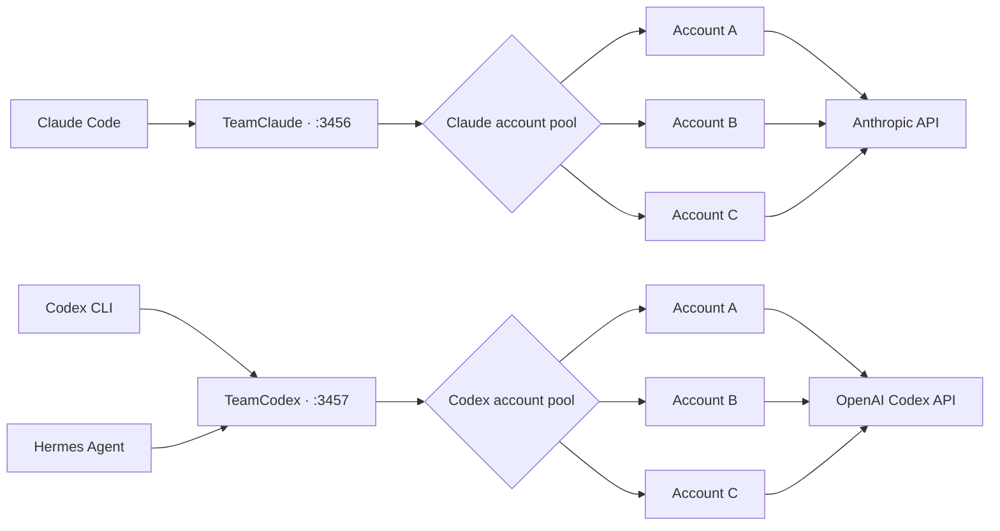

<p align="center">
  <strong>English</strong> ·
  <a href="README.ko.md">한국어</a> ·
  <a href="README.zh-CN.md">简体中文</a>
</p>

<p align="center">
  
</p>

<h1 align="center">TeamClaude · TeamCodex</h1>

<p align="center">
  <strong>One local proxy. Every coding account. No interrupted sessions.</strong>
</p>

<p align="center">
  Run Claude Code and OpenAI Codex CLI through independent multi-account pools<br>
  with quota-aware routing, instant failover, and a live terminal dashboard.
</p>

<p align="center">
  
  
  
  <a href="LICENSE"></a>
</p>

<p align="center">
  <a href="#quick-start"><strong>Quick Start</strong></a> ·
  <a href="#codex-multi-account-setup"><strong>Codex Setup</strong></a> ·
  <a href="#live-dashboard"><strong>Dashboard</strong></a> ·
  <a href="#how-it-works"><strong>Architecture</strong></a>
</p>

> [!NOTE]
> Claude and Codex use separate configs, ports, and account pools. Both proxies can stay online together, while Codex CLI and Hermes Agent keep using one stable local endpoint.

## Install

```bash
npm i -g teamcodex

teamcodex import          # pick up your existing Claude Code login
teamcodex codex import    # pick up your existing ~/.codex/auth.json
teamcodex server          # start the proxy, then `teamcodex run`
```

The package installs both commands: `teamclaude` for the Claude pool and
`teamcodex` for the same CLI entry point plus provider subcommands. The examples
below use `teamclaude` for Claude and `teamclaude codex` for Codex.

Prefer installing straight from the repository? `npm i -g github:sangrokjung/teamclaude`
works too and always tracks the default branch.

## Is this against the Terms of Service?

No. This does not share, resell, or pool accounts between people.

> **One exception, added by this fork.** The opt-in BYOK surface (see *BYOK surface* under Configuration) relays a **third-party** client's request after normalizing it to the shape the upstream accepts from a first-party client. That is outside the "same client, your own sessions" reasoning below. It ships off, and enabling it is your decision and your risk.

It routes **your own** authenticated sessions from **one machine**, which is exactly
what you would do by switching accounts by hand, minus the manual re-login. Every
request is signed with that account's own OAuth token, and nothing is proxied on behalf
of third parties. Credentials are stored locally and only ever sent to the vendor's own
endpoints, exactly as the CLI would send them. No third party sees them.

It does not increase your quota and it does not bypass any limit. It stops the quota
you already paid for from expiring unused.

Worth noting: Claude Code's own `/extra-usage` flow already offers to sign into a
**different account you own** when you hit a limit. "Switch to another of my accounts
to keep working" is something the first-party client itself surfaces. This automates
that same switch instead of making you click through it by hand.

If you work in a team, every member still authenticates with their own subscription.
Using this to let several people share a single seat is not supported, and if a vendor
states that this class of tool is disallowed, this project will be changed or retired
accordingly.

## Credit and relationship to upstream

Fork chain: [KarpelesLab/teamclaude](https://github.com/KarpelesLab/teamclaude) →
[jung-wan-kim/teamclaude](https://github.com/jung-wan-kim/teamclaude) → this repository.
The fork badge at the top of this page shows the immediate parent, which is why it reads
jung-wan-kim rather than the original author.

This started as a fork of [KarpelesLab/teamclaude](https://github.com/KarpelesLab/teamclaude),
which does the Claude side very well and is worth using on its own. This fork went a
different direction when it needed **Codex (ChatGPT OAuth) account pooling**, which
upstream does not cover, plus a model fallback chain and network-level failover.
Upstream has features this fork does not, so pick whichever fits your setup.

## Live dashboard

<p align="center">
  
</p>

<p align="center"><sub>Actual TeamCodex TUI layout rendered with sanitized demo accounts.</sub></p>

## Why this exists

AI coding subscriptions have independent session and weekly limits. A long-running
terminal should not die just because one account reaches its cap. TeamClaude and
TeamCodex keep the client connected to a stable local endpoint and move new work to
the best available account automatically.

<table>
  <tr>
    <td width="50%">
      <strong>⚡ Seamless failover</strong><br>
      Switch accounts on quota, rate, network, or upstream failures without changing the client command.
    </td>
    <td width="50%">
      <strong>🧭 Quota-aware routing</strong><br>
      Spend the account whose weekly allowance resets soonest, preserving quota that would otherwise expire unused.
    </td>
  </tr>
  <tr>
    <td width="50%">
      <strong>🧠 Cache-friendly affinity</strong><br>
      Keep sequential turns on the same account while spreading concurrent overflow across the pool.
    </td>
    <td width="50%">
      <strong>🖥️ Operable by humans</strong><br>
      Inspect usage, switch accounts, disable unhealthy entries, and reorder priorities from the TUI.
    </td>
  </tr>
</table>

<details>
<summary><strong>What the QJC resilient-routing fork adds</strong></summary>

This is the `qjc/resilient-routing` fork, published to npm as `teamcodex`, of
[jung-wan-kim/teamclaude](https://github.com/jung-wan-kim/teamclaude), based on
upstream `v1.2.3`.

- **Codex subscription pooling** with isolated official OAuth login sessions.
- **Top-tier weekly-window model routing** for model-scoped `7d_oi` quota.
- **Model fallback chains** through configurable `modelFallbacks`.
- **Bounded graceful shutdown** for reliable launchd/systemd restarts.
- **Method-aware network recovery** with bounded failover for replay-safe requests and no hidden replay of ambiguous POSTs.
- **Host CPU and RAM tracking** in status JSON, CLI output, and the TUI.
- **Hermes Agent compatibility** through the stable TeamCodex endpoint.

Install this fork with one command:

```bash
npm install -g teamcodex
```

From a local checkout, prefer
`npm pack && npm install -g ./teamcodex-<version>.tgz`. A plain
`npm install -g <dir>` symlinks the checkout, which can break supervisors that
cannot read that path.

### Install on multiple Macs

Install the same pinned package independently on every Mac. From a checkout,
build one tarball and pass that exact file to the included installer on each
machine:

```bash
TARBALL=$(npm pack --silent)
TARBALL_PATH="$PWD/$TARBALL"
tar -xOf "$TARBALL_PATH" package/scripts/install-macos.sh | bash -s -- --check-only
tar -xOf "$TARBALL_PATH" package/scripts/install-macos.sh |
  bash -s -- --source "$TARBALL_PATH"
```

The installer changes only the global npm package. It never reads, copies, or
synchronizes `~/.config/teamclaude.json`, `~/.config/teamcodex.json`,
`~/.claude/.credentials.json`, or `~/.codex/auth.json`.

Run OAuth login/import separately on every Mac. Do not copy an OAuth config
between machines: refresh endpoints can rotate the refresh token, so two Macs
sharing one refresh chain can invalidate each other. Non-secret settings such
as thresholds or fallback models may be applied separately, but credentials,
quota snapshots, state files, and ports remain owned by each machine. See the
[multi-Mac runbook](docs/runbooks/multi-mac-installation.md).

</details>

## Features

- **Use-or-lose account priority** — measures each account once at startup, then prioritizes the account whose weekly (7d) quota resets soonest (then soonest session reset, then lowest usage), so quota about to renew unused is drained first; re-evaluates every 5 minutes and switches immediately when the active account reaches the quota threshold (default 98%). Pin explicit ranks in the TUI (`o`) or via `teamclaude priority` for the accounts you want first — everything unranked stays on this automatic (`auto`) ordering
- **Codex subscription pooling** — `teamclaude codex ...` manages a separate ChatGPT OAuth account pool, injects each account's bearer token and `ChatGPT-Account-ID`, tracks the official `x-codex-primary-*` / `x-codex-secondary-*` windows, and fails exhausted requests over to the next Codex subscription
- **Instant failover on 429** — an exhausted account (token quota hit) is throttled for its `retry-after` (clamped to 1s–5m) and skipped; a rate/concurrency 429 (quota left but hit too fast) tries up to `rateLimitFailovers` alternate accounts so concurrent overflow spreads instead of erroring. After that budget, transient/global 429s keep the original model, never throttle the fleet, and are retried internally within the bounded continuity deadline
- **Interactive TUI** — real-time dashboard with numbered account rows, color-coded quota bars showing usage %, reset countdowns, an activity log, and keyboard controls (switch, enable/disable, reorder accounts)
- **Manual account controls** — enable/disable accounts and pin an explicit account order from the TUI or CLI (`teamclaude disable|enable|priority`); a disabled account is excluded from rotation while its in-flight requests drain, and everything unranked stays on automatic use-or-lose ordering
- **Quota survives restarts** — general per-account quota state *and* the warm-up probe template are snapshotted to `<config>.quota.json` (every minute and on exit) and restored at startup. Model-scoped usage is deliberately not restored: every Fable/Mythos window starts unknown and is re-measured from runtime traffic
- **Account-first Fable/Mythos routing** — only an account with a fresh, finite, full model-scoped window is skipped for that top-tier request. Any generally available account (enabled, auth-healthy, and under its general 5h/7d limits) whose model window is unknown, expired, or ready keeps the original model eligible; Opus, Sonnet, and Haiku eligibility is never removed by a Fable/Mythos window
- **Active warm-up** — after a (re)start the proxy probes eligible unmeasured accounts with a minimal request (reusing the last accepted request shape), so response-derived quota data populates without waiting for normal traffic to reach each account
- **Server lifecycle** — `teamclaude stop` / `teamclaude restart` cleanly stop or replace the running server from any terminal
- **OAuth token management** — automatically refreshes tokens nearing expiry and persists them to config; client token refreshes pass through untouched. A periodic keep-alive sweep (default 5 min) also refreshes **idle** accounts' expiring tokens — including parked and disabled accounts — so their refresh-token chains stay alive with zero traffic. A refresh-caused error self-heals on success; an upstream-auth rejection stays parked until re-import/login
- **Hot-reload accounts** — add accounts via `import` or `login` while the server is running, press **R** to pick them up; **R** also force-re-measures every idle account, including disabled accounts, so the dashboard reflects usage spent outside this proxy and reports an honest `M/N`
- **Account deduplication** — detects duplicate accounts by UUID and keeps the most recent
- **Request logging** — optional full request/response logging for debugging
- **Host CPU / RAM tracking** — live host CPU%, 1/5/15-min load average, and RAM usage in the TUI header, `teamclaude status`, and the `/teamclaude/status` JSON (`host` field); measured with Node built-ins only
- **BYOK surface (fork)** — an opt-in `/byok` path prefix that lets an Anthropic-Messages-shaped third-party "bring your own key" client (an editor plugin, an AI browser's main process, your own script) use the pool. The proxy normalizes the request into the shape the upstream accepts from a first-party client, and strips browser-context headers the upstream rejects, while Claude Code traffic on `/v1/*` stays byte-identical. Off unless configured, and see the Terms of Service note before enabling
- **Zero dependencies** — uses only Node.js built-in modules

## Quick Start

Requires Node.js 18+.

```bash
# Install from npm
npm install -g teamcodex

# Add your first account (opens browser for OAuth)
teamclaude login

# Add a second account
teamclaude login

# Start the proxy
teamclaude server

# In another terminal, run Claude Code through the proxy
teamclaude run
```

> **Important:** a running proxy does not automatically capture a plain `claude`
> process. Start Claude Code with `teamclaude run`; otherwise it connects directly
> with its single logged-in account and cannot rotate when that account reaches a
> usage limit.

You can also import existing Claude Code credentials instead of logging in:

```bash
claude /login           # Log into an account in Claude Code
teamclaude import       # Import its credentials
```

## Codex Multi-account Setup

Codex uses a separate config (`~/.config/teamcodex.json`) and port (`3457`), so
the Claude and Codex proxies can run at the same time.

```bash
# Add accounts with isolated official Codex OAuth sessions.
# Each login uses a temporary CODEX_HOME, so its refresh token is owned only by
# TeamCodex after import and cannot race the normal ~/.codex/auth.json.
teamclaude codex login --name codex-pro-1
teamclaude codex login --name codex-pro-2

# Start the Codex proxy
teamclaude codex server

# In another terminal, run the interactive Codex CLI through the account pool
teamclaude codex run

# Non-interactive Codex commands are forwarded after `--`
teamclaude codex run -- exec "summarize this repository"
```

Codex chooses its `model_provider` when the TUI process starts. Reloading the
shell cannot move an already-running Codex process to TeamCodex. After exiting
an affected TUI, resume the exact conversation bound to the current cmux tab:

```bash
# Uses the current surface's trusted Codex checkpoint; no recent-session picker
teamcodex codex resume

# Or bypass every picker with a known session ID
teamcodex codex resume SESSION_ID
```

The no-ID form fails closed when cmux is unavailable or the current surface
does not have a valid Codex resume binding. It never guesses from working
directory or recency. Start new sessions with `teamcodex codex run`; cmux then
records the exact checkpoint together with the TeamCodex provider overrides,
so later tab restoration keeps the proxy route. Run and resume reject Codex
provider/base-URL overrides (including compact `-cVALUE`/`-c=VALUE`) plus
`--remote`, `--remote-auth-token-env`, `--oss`,
and `--local-provider` because they would leave that route. See the
[Codex provider/session recovery runbook](docs/runbooks/codex-provider-session-recovery.md)
for diagnosis and legacy-session recovery.

When a TeamCodex-launched Codex process exits unexpectedly, the wrapper
automatically reopens it **once** only if the proxy recorded a short-lived,
one-time receipt binding this wrapper invocation to the exact Codex session and
that UUID matches the current cmux surface. An explicit
`codex resume SESSION_ID` may retry only that same ID. Signals, cancel status
130, ordinary config/auth errors, missing or mismatched receipts,
missing/malformed/unchanged bindings, and a second failure stop without another
launch. This is session recovery, not hidden HTTP replay: an uncertain POST is
never dispatched twice by the proxy.
The recovery notice does not expose the checkpoint UUID, and receipt
consumption plus the cmux lookup share a strict five-second total budget.

You can import the account currently logged into the official Codex CLI instead:

```bash
codex login
teamclaude codex import --name codex-pro-1
```

The isolated `teamclaude codex login` flow is recommended. A direct import copies
the same rotating refresh token used by `~/.codex/auth.json`; running plain
`codex` afterward can rotate that token outside the proxy. If that happens,
re-import the account or log it in again through `teamclaude codex login`.

`teamclaude codex run` starts an HTTP-only Responses provider with
`requires_openai_auth = false` and redirects `chatgpt_base_url` to the local
proxy, while `supports_websockets = false` keeps the default Responses
WebSocket from bypassing the HTTP proxy. The proxy discards any client-sent
bearer token and account ID before forwarding, then injects the selected pool
account's credentials. The local Codex CLI therefore needs **no ChatGPT login
of its own** to run through the proxy, and a revoked or expired `~/.codex/auth.json`
can never block `codex run` with the sign-in screen while the pool is healthy
(this was the failure mode before 2026-08-03, when the override still set
`requires_openai_auth = true`).

Codex usage is learned from response headers as traffic flows, so newly added
accounts show unmeasured quota until each account handles a request.

Common controls mirror the Claude pool:

```bash
teamclaude codex status
teamclaude codex accounts
teamclaude codex disable codex-pro-1
teamclaude codex enable codex-pro-1
teamclaude codex priority codex-pro-2 0
teamclaude codex restart
```

## Grok and Agy account pools

Grok and Agy use independent subscription OAuth pools, config files, and ports. Each
config contains one provider; credentials are stored in the 0600 config and never
shown in status output.

```bash
# xAI Grok (default: ~/.config/teamgrok.json, port 3458)
teamclaude grok login --name grok-main    # opens official Grok OAuth in isolated home
teamclaude grok import --from ~/.grok/auth.json --name grok-main
teamclaude grok server
teamclaude grok env

# Google Antigravity / Gemini-compatible upstream
teamclaude agy login --name agy-main      # imports consumer OAuth from macOS Keychain and resolves the Google account identity
teamclaude agy import --from ./agy-credential.json --name agy-main
teamclaude agy server
teamclaude agy env
```

Grok and Agy subscription credentials are sent as `Authorization: Bearer`. Grok uses
`https://cli-chat-proxy.grok.com/v1` and Agy uses the consumer Cloud Code endpoint
`https://daily-cloudcode-pa.googleapis.com` by default. `--api-key` is rejected for
both providers. Existing `accounts`, `disable`, `enable`, `priority`, and `api`
commands work with both provider pools.

### Hermes Agent through TeamCodex

Keep the Codex proxy running and point Hermes at the stable local endpoint:

```yaml
# ~/.hermes/config.yaml
model:
  default: gpt-5.6-sol
  provider: openai-codex
  base_url: http://127.0.0.1:3457
```

If Hermes has `openai-codex` entries in its credential pool, set each entry's
`base_url` to the same local endpoint as well. Restart the Hermes gateway after
changing its configuration. Hermes keeps talking to one stable URL while
TeamCodex selects, refreshes, and rotates the upstream Codex account.

Run `teamclaude codex server` in a TTY to open the Codex account dashboard.
It uses the Codex config and port independently from the Claude dashboard, so
both proxies can stay online at the same time. For a non-interactive health
check, use `teamclaude codex status`.

## Adding Accounts

### OAuth Login (recommended)

The easiest way to add accounts — opens your browser for authentication:

```bash
teamclaude login
```

Uses the same OAuth flow as Claude Code. Auto-detects the account email and subscription tier. Logging in with the same account again updates its credentials.

You can add accounts while the server is running — press **R** in the TUI to reload.

### Import from Claude Code

If you already have Claude Code set up, you can import its credentials directly:

```bash
claude /login           # Log into an account in Claude Code
teamclaude import       # Import its credentials
```

Re-importing the same account updates its credentials. You can also import from a custom path:

```bash
teamclaude import --from /path/to/credentials.json
```

### API Key

For Anthropic API key accounts (billed via Console):

```bash
teamclaude login --api
```

## Usage

### Start the proxy server

```bash
teamclaude server
```

When running from a TTY, shows an interactive TUI with:
- Account table with **numbered rows** and session/weekly quota progress bars (usage % overlaid, plus a reset countdown when space allows); wide terminals add a third `Fbl` bar with the model-scoped weekly limit (the separate "Fable" weekly limit from Claude's usage UI). Ranked accounts are listed first, then the `auto` accounts in their actual drain order (weekly reset soonest first)
- Real-time activity log with request tracking
- Keyboard shortcuts (see below)

Falls back to plain log output when not a TTY (e.g. running as a service).

If the configured port is already in use — for example another TeamClaude proxy is already running — the server prints a clear message and exits instead of crashing with an unhandled error. Inspect the existing one with `teamclaude status`, or find the listener with `lsof -nP -iTCP:<port> -sTCP:LISTEN`.

#### TUI Keyboard Shortcuts

| Key | Action |
|-----|--------|
| `↑`/`↓` | Move the selection cursor over the accounts |
| `s` | Switch active account (to the selected one) |
| `e` | Enable / disable the selected account |
| `o` | Order the selected account: `↑`/`↓` move its rank, `a` resets the WHOLE order to `auto` (weekly-reset ordering), `c` clears just this account's rank |
| `a` | Add account (import or API key) |
| `d` | Delete an account (with confirmation) |
| `R` | Reload accounts from config and best-effort re-measure idle accounts — includes disabled accounts for display, skips busy and auth-error accounts, and reports an honest `M/N`; `Fbl` refreshes only when the probe template returns a model-scoped weekly header |
| `q` | Quit |

In selection mode, use `j`/`k` or arrow keys to navigate, `Enter` to confirm, `Esc` to cancel.

### Stop / restart the server

```bash
teamclaude stop       # SIGTERM the running server (escalates to SIGKILL if needed)
teamclaude restart    # stop the running server (if any) and start a fresh one
```

The running server is discovered via its state file (`<config>.server.json`) with a port-probe fallback, so `stop`/`restart` work from any terminal — even after a config port change. Quota state is restored on restart (see below), so a restart doesn't lose the dashboard.

> **Note:** if a Claude Code session is itself routed through the proxy (`teamclaude run`), running `teamclaude stop` *inside that session* severs its own API connection (`Unable to connect to API (ConnectionRefused)`). Stop or restart the proxy from a separate terminal instead — with `restart`, an in-flight session recovers on its own retries.

### Account order & manual controls

By default every account is on **`auto`** ordering (use-or-lose: weekly reset soonest is drained first). You can layer manual controls on top:

```bash
teamclaude disable <name>            # exclude from rotation (in-flight requests drain)
teamclaude enable <name>             # re-enable
teamclaude priority <name> <n|auto>  # pin explicit order (lower = preferred); "auto" clears it
```

In the TUI, `↑`/`↓` select an account, `e` toggles enable/disable, and `o` grabs the selected account into order mode: `↑`/`↓` move its rank, `a` resets the WHOLE order back to `auto`, `c` clears just that account's rank, `Enter`/`Esc` done. Ranked accounts render as `#1 #2 …` and are preferred first; everything unranked stays on the automatic ordering — so you can pin a few accounts and let the rest rotate.

CLI changes made while the server is running are picked up with **R** (reload) in the TUI or `teamclaude restart`.

### Run Claude Code through the proxy

```bash
teamclaude run
```

`teamclaude run` injects the proxy URL when the Claude Code process starts and
removes inherited `ANTHROPIC_API_KEY` / `ANTHROPIC_AUTH_TOKEN` values so Claude
Code keeps its Max/Pro OAuth subscription instead of silently preferring API
credits. A `CLAUDE_CODE_OAUTH_TOKEN`, when intentionally supplied, is preserved.
If the proxy is not running, `teamclaude run` now starts it in the background
and waits for the listener before launching Claude Code. The server keeps that
public listener in a supervisor process, so a crashed proxy worker is replaced
while new connections wait instead of failing with `ConnectionRefused`.

If Anthropic rejects one OAuth account with the structured
`oauth_not_allowed_for_organization` 403, TeamClaude parks only that account as
an auth error and retries the completed rejection on another available account.
Other permission 403s are passed through unchanged and never poison the pool.
If every account is rejected, the last original 403 remains visible so an admin
can enable Claude Code subscription access or the operator can re-import/login
the account. Quarantined accounts are independently rechecked with the last
known-good request shape every 15 minutes by default and return to rotation on
an accepted 2xx, even when quota warm-up is startup-only (`warmupIntervalMs: 0`).
See [the subscription-disabled runbook](docs/runbooks/claude-subscription-disabled.md).

With `autoResumeClaude: true`, the launcher gives a new Claude Code conversation
an explicit session ID and watches only that transcript for terminal API errors.
`Request timed out` and terminal rate/overload errors restart the same conversation
as `--resume <session-id> continue`, up to `claudeAutoResumeMaxRetries`, so an
interactive session does not wait indefinitely at the prompt for a person.

When the proxy returns `All N accounts exhausted. Retry in Ns.`, the recovery
parent does not retry early with the short generic backoff. It waits for the
server-provided `Retry in` duration, then restarts the same session as
`--resume <session-id> continue`. This restart counts toward
`claudeAutoResumeMaxRetries`, and Ctrl-C can cancel the parked launcher. When
`codexFallbackOnExhaustion: true` has fresh evidence that the whole general
quota fleet is exhausted, the existing Codex handoff still takes precedence.

Existing Claude processes cannot acquire a recovery parent retroactively.
On cmux, `cmuxSessionRescue: true` lets the stable TeamClaude supervisor watch
cmux's session registry for an unresolved `Login expired` event. It continues
only owner-private registry/transcript files whose active session ID, exact
process selector and start time, trusted Claude executable, cmux surface,
working directory, and transcript root all still match. The verified live
surface is resolved through cmux's current topology and must still belong to
the recorded workspace. Stale, redirected, or already supervised records fail
closed. After a final registry and process recheck, TeamClaude durably claims
the session and opens one non-focused workspace in the same cmux window. The
same session is not replayed after a supervisor restart, even when the workspace
launch result was uncertain. The blocked legacy pane remains untouched. This
option is off by default because it adds a recovery workspace for each affected
legacy session.

`codexFallbackOnExhaustion: true` additionally hands the conversation to TeamCodex
when an exact expired-login recovery receives a confirmed `no_alternative_account`
response, or when every enabled Claude account has a fresh, finite general quota
window at or above `switchThreshold`. A transient rotation failure, Fable-only
`7d_oi` exhaustion, transient queue, or unknown/partial quota evidence cannot
trigger the provider switch. The launcher writes a credential-protected,
provider-neutral transcript summary under
`~/.config/teamclaude-handoffs/`, stops the Claude child, and starts one Codex CLI
with that handoff. Tool inputs and tool results are excluded from the handoff.
When `launchModel` is configured, `teamclaude run` also checks the proxy's latest
quota status before launch. It starts Claude Code directly on the first configured
fallback only when **every generally available account** has a fresh, measured,
finite model-scoped window that is full. An unknown or expired window preserves
the configured top-tier model so startup cannot downgrade before the fleet is
measured. For `claude-opus-4-8`, the launch argument is rendered
as `claude-opus-4-8[1m]`, so Claude Code's header and `/status` show the model and
context window actually serving the session. An explicit non-fallback `--model`
or `ANTHROPIC_MODEL` remains authoritative.
Starting or restarting TeamClaude later does **not** reroute an already-open
direct session, which can still show "out of usage credits" for its single
logged-in account while the proxy itself is healthy.

Exit that direct session and resume it through TeamClaude from the same working
directory:

```bash
teamclaude run -- --continue
# Or resume a specific conversation:
teamclaude run -- --resume <session-id>
```

Or manually set the environment:

```bash
eval $(teamclaude env)
claude
```

### Troubleshoot `ConnectionRefused`

`Unable to connect to API (ConnectionRefused)` means Claude Code could not reach
the local TeamClaude supervisor. New sessions started with `teamclaude run`
automatically start a missing supervisor; a worker-only crash keeps the listener
bound and is recovered automatically. If the supervisor itself was stopped,
check it from a separate terminal:

```bash
teamclaude status
lsof -nP -iTCP:3456 -sTCP:LISTEN
teamclaude restart

# Resume the conversation through the recovered proxy
teamclaude run -- --continue
```

The PID shown by `lsof` is the stable TeamClaude supervisor. Its worker PID may
change after a crash without creating a no-listener window. Do not run
`teamclaude stop` from inside the affected proxied Claude Code session.

### Host CPU / RAM line

`teamclaude status` prints a `Host:` line for the machine the *proxy* runs on:

```
Host:           CPU 43.3% (load 18.99 / 16 cores)   RAM 63.2GB/64.0GB (98.8%)
```

CPU% is measured between two status calls (the counters are cumulative), so the
very first call after a server start shows `-`. The TUI header shows the same
numbers compactly (`CPU 43% · RAM 98% · Port 3456 ▲`), turning yellow at 70%
and red at 90% — a host drowning in Claude Code sessions kills the proxy along
with everything else, so it gets a gauge right next to the quota bars. The raw
values (including the full 1/5/15-minute load-average triple and byte counts)
are in the `host` field of `GET /teamclaude/status`.

### Understand the quota numbers

`teamclaude status` and the TUI show the latest quota headers observed by the
proxy, not an on-demand account usage query. They can lag usage spent in another
Claude Code session or on another device. Pressing **R** best-effort re-probes
eligible idle accounts and refreshes only the headers returned by the captured
probe template. Disabled accounts are included for display without being
re-enabled; busy and auth-error accounts are skipped. `Fbl` can remain stale
until a top-tier request shape returns the model-scoped weekly header.

Current Claude Code OAuth builds also expose their own account usage view. It
uses an OAuth-only implementation surface rather than a documented general
Anthropic API, so TeamClaude does not depend on it for routing. When the views
disagree, treat Claude Code's account usage view as the live account check and
TeamClaude as the proxy's last observation.

Every applicable window matters. A `Fbl` bar below 100% does not mean Fable can
run when the general 5-hour or 7-day window is already at `switchThreshold`.
For example, 59% Fable usage with 99% 5-hour usage is unavailable at the default
98% threshold until the 5-hour window resets.

The per-account `Total: … tokens` counter folds **all three input families** —
`input_tokens` (uncached prompt), `cache_creation_input_tokens`, and
`cache_read_input_tokens` — plus output tokens. Anthropic's `input_tokens`
excludes the prompt cache, and Claude Code keeps almost the whole context cached,
so counting `input_tokens` alone made the total accumulate only a few hundred
tokens per request; `sumInputTokens` in `server.js` sums the cache fields so the
displayed total reflects real volume (qjc fork).

> **QJC account-first guard:** `modelWeekly` is response-derived and is not
> restored after restart, so each model-scoped window starts unknown. At runtime,
> a fresh, finite window at or above `switchThreshold` skips only that account
> for the matching Fable/Mythos request. If any generally available account has
> an unknown, expired, or ready window, the original top-tier model remains
> account-first; a cached-fleet fallback is allowed only when every such account
> is fresh, measured, and full. Runtime evidence can also trigger fallback only
> after a labeled model-tier 429 reaches every eligible account. Unlabeled/global
> 429s keep the original model. These windows never remove an account's
> Opus/Sonnet/Haiku eligibility. If a global installation carries additional
> local patches, validate or reapply them in the service startup path because an
> npm or Node upgrade can replace globally installed source files.

### Other commands

```bash
teamclaude accounts          # List accounts with subscription tier and token status
teamclaude accounts -v       # Also show token expiry times
teamclaude status            # Show the proxy's last-observed quota status (requires running server)
teamclaude stop              # Stop the running proxy server
teamclaude restart           # Stop the running server and start a fresh one
teamclaude remove <name>     # Remove an account
teamclaude disable <name>    # Disable an account (excluded from rotation)
teamclaude enable <name>     # Re-enable a disabled account
teamclaude priority <name> <n|auto>  # Pin selection order (lower = preferred; "auto" clears)
teamclaude api <path>        # Call an API endpoint with account credentials
teamclaude help              # Show all commands
```

### Request logging

Log full request/response details to a directory (one file per request):

```bash
teamclaude server --log-to /tmp/requests
```

## Configuration

Config is stored at `~/.config/teamclaude.json` (or `$XDG_CONFIG_HOME/teamclaude.json`). A random proxy API key is generated on first use.

Override the config path with `TEAMCLAUDE_CONFIG`:

```bash
TEAMCLAUDE_CONFIG=./my-config.json teamclaude server
```

### Config format

```json
{
  "proxy": {
    "port": 3456,
    "apiKey": "tc-auto-generated-key"
  },
  "upstream": "https://api.anthropic.com",
  "switchThreshold": 0.98,
  "accounts": [
    {
      "name": "user@example.com",
      "type": "oauth",
      "accountUuid": "...",
      "accessToken": "<access-token>",
      "refreshToken": "<refresh-token>",
      "expiresAt": 1774384968427,
      "enabled": true,
      "priority": 0
    }
  ]
}
```

| Field | Description |
|-------|-------------|
| `proxy.port` | Local port the proxy listens on |
| `proxy.apiKey` | API key clients use to authenticate with the proxy |
| `upstream` | Upstream API base URL |
| `switchThreshold` | Quota utilization (0–1) at which an account is considered full and skipped |
| `reevalIntervalMs` | How often (ms) to re-rank accounts by priority while the active one is healthy (optional, default `300000` = 5 min). Set to `0` to disable the timer entirely — the active account then only changes when it becomes unavailable or via per-request 429 failover |
| `activeWarmup` | Probe unmeasured accounts after a restart to populate quota (optional, default `true`) |
| `warmupIntervalMs` | How often (ms) the active warm-up re-probes accounts whose quota window reset (optional, default `300000` = 5 min; `0` = startup-only) |
| `tokenRefreshIntervalMs` | How often (ms) the token keep-alive sweep runs across expiring, expired, parked, and disabled OAuth accounts (optional, default `300000` = 5 min; positive values are clamped to at least `60000`; `0` = disabled). A refresh-caused `error` self-heals on success; an upstream-auth `error` stays parked until re-import/login |
| `continuityMode` | Hold requests in the proxy while quota or transient/global 429 limits recover within the continuity deadline; HTTP 529/5xx, network errors, and incomplete SSE attempts are retried internally only for replay-safe methods, never for an ambiguous POST (optional, default `true`) |
| `streamRecovery` | Frame Anthropic SSE responses and, with continuity mode, publish only a terminally complete attempt; broken replay-safe attempts may retry transparently, while an ambiguous POST is returned as a retryable error without hidden replay (optional, default `true`) |
| `maxResponseBytes` | Maximum bytes buffered per upstream response before returning 502; covers transactional SSE, non-SSE, and OAuth relay responses (optional, default `67108864` = 64 MiB) |
| `upstreamResponseTimeoutMs` | Total deadline for upstream response headers and buffered non-SSE response bodies (optional, default `300000` = 5 minutes) |
| `streamIdleTimeoutMs` | Maximum idle time between upstream SSE chunks or while waiting for a downstream client to drain; expiry cancels the stream and releases proxy capacity (optional, default `300000` = 5 minutes) |
| `streamTotalTimeoutMs` | Hard ceiling for one Anthropic SSE response even when keepalive/ping chunks keep resetting the idle timer; expiry becomes a retryable overload before Claude Code's own request timeout (optional, Claude default `900000` = 15 minutes; Codex default disabled) |
| `requestBodyTimeoutMs` | Total deadline for receiving a client request body before returning 408 and releasing admission capacity (optional, default `30000` = 30 seconds) |
| `maxBufferedRequestBytes` | Total request-buffer memory budget used to cap admission before buffering; supervised requests count both supervisor and worker copies (optional, default `268435456` = 256 MiB) |
| `continuityMaxWaitMs` | Total continuity deadline for internally recovering quota and transient/global 429 responses (optional, default `900000` = 15 minutes) |
| `continuityMaxSleepMs` | Maximum interval between continuity recovery probes (optional, default `30000` = 30 seconds) |
| `rateLimitFailovers` | Alternate accounts tried before treating a non-quota 429 as global (optional, default `1`) |
| `accounts[].enabled` | Set `false` to exclude the account from rotation (optional, default `true`) |
| `accounts[].priority` | Explicit selection rank (lower = preferred first; optional — unset means automatic use-or-lose ordering) |
| `modelFallbacks` | Fork only — per-model fallback chains applied when the cached generally available fleet is fresh-full or a live labeled model-tier 429 reaches every eligible account. Unknown/expired/ready cached windows and unlabeled/global 429s stay account-first; a fleet that is only locally capped or queued for concurrency never changes the model (optional, default `{}`; see below) |
| `byok` | Fork only — opt-in path-prefix surface that lets a third-party BYOK client use the pool; the proxy normalizes the request shape upstream requires and gates the lane with its own key (optional, default disabled; see *BYOK surface* below and the Terms of Service note) |
| `launchModel` | Fork only — preferred Claude Code model for `teamclaude run`; launch directly on the first `modelFallbacks` target only when every generally available account is freshly measured full for that model (optional, default `null`) |
| `autoResumeClaude` | Watch the launched Claude transcript and restart the same session after terminal timeout/rate/overload errors (optional, default `true`) |
| `claudeAutoResumeMaxRetries` | Maximum same-session automatic resumes before leaving Claude interactive for manual control (optional, default `3`) |
| `claudeAutoResumeBackoffMs` | Initial automatic-resume delay; retries use capped exponential backoff (optional, default `2000`) |
| `codexFallbackOnExhaustion` | After a terminal Claude error, stop Claude and launch TeamCodex with a sanitized handoff only when expired-login rotation confirms no alternate account or every enabled account has fresh general-quota exhaustion evidence; transient rotation failures do not switch providers (optional, default `false`) |
| `cmuxSessionRescue` | Opt in to fail-closed adoption of active cmux Claude sessions already blocked on `Login expired`; owner-private files, exact session selector/start identity, trusted executable, and live surface→workspace topology must match. A durable per-session claim prevents replay across supervisor restarts, and recovery uses a new non-focused workspace without replacing the legacy pane (optional, default `false`) |
| `cmuxSessionRescueIntervalMs` | Poll interval for existing cmux session rescue; values below 500 ms are clamped (optional, default `1000`) |
| `workerHealthTimeoutMs` | Supervisor HTTP health-probe deadline (optional, default `5000`). A timeout during supervisor self-stall is inconclusive rather than evidence against the worker |
| `workerHealthFailureThreshold` | Consecutive conclusive health failures before IPC corroboration/recycle (optional, default `3`) |
| `workerRecycleGraceMs` | SIGTERM drain grace for a conclusively broken worker before SIGKILL (optional, default `5000`) |

### Model fallbacks (fork)

```json
{
  "launchModel": "claude-fable-5",
  "modelFallbacks": {
    "claude-fable-5": ["claude-opus-4-8"],
    "claude-mythos-5": ["claude-opus-4-8"]
  }
}
```

The proxy rewrites the request body's `model` to the next entry of the chain and
retries under normal routing through either of two paths: the cached generally
available fleet is entirely fresh, finite, and full for the model tier (`7d_oi`),
or a live labeled model-tier 429 has reached every eligible account. A cached
fresh-full fleet falls back before continuity sleeps. Semantics:

- The chain is resolved **once per request from the original model** (fallbacks of fallbacks are not followed) and consumed in order; when it runs dry, the pre-existing 429/continuity behavior applies unchanged.
- For Claude Code advisor requests, a direct root `tools[]` entry whose `type` starts with `advisor_` supplies the governing model. Routing and 429 classification use that nested model, and fallback rewrites only that tool's `model`, leaving the top-level executor model unchanged.
- Keys and targets must be **plain API model IDs**. A client-side bracket suffix (`claude-fable-5[1m]` — the API rejects such IDs as `not_found_error`) matches its suffix-stripped entry.
- `launchModel` keeps those API IDs plain in config. Only the Claude Code launch
  display adds `[1m]` to Opus 4.8; Claude Code strips that suffix before sending
  the request to the proxy.
- In the cached precheck, an account with an unknown, expired, or non-full model window is tried with the original Fable/Mythos model before fallback. A fresh-full window excludes only that account for that request and does not affect its Opus/Sonnet/Haiku eligibility.
- Independently of that cached precheck, fleet-wide live labeled model-tier 429 evidence can trigger fallback.
- Fallback runs **before** a continuity-mode sleep when the cached fleet is fresh-full: rewriting to a served model beats sleeping until a weekly reset.
- A fleet that is only locally capped or queued for concurrency keeps the original model. Unlabeled transient/global 429 recovery also keeps the original model and enters continuity after the account failover budget is handled, within `continuityMaxWaitMs`; no account state is poisoned.
- Mind quality expectations when composing chains: a background agent may be fine falling all the way to a small model, but an interactive session usually is not — this fork's author runs `fable → opus` only, preferring a surfaced 429 (client retries/waits) over silently degrading below Opus.

### BYOK surface (fork)

Third-party clients that support "bring your own key" — a base URL plus an API
key per provider — cannot reach this proxy on the normal paths, even though the
pool would happily serve them. The upstream rejects a request that does not
arrive in the shape it expects from a first-party client, and it rejects a
request carrying browser-context headers. A client cannot fix either from its
own provider config, so the proxy does it — **only** on a dedicated path prefix.

Read the Terms of Service note near the top of this README before enabling this.
Unlike the rest of the proxy, this surface relays a third-party client's traffic.

```json
{
  "byok": {
    "enabled": true,
    "prefix": "/byok",
    "apiKey": "byok-change-me-to-a-secret",
    "minUsableAccounts": 2,
    "maxConcurrent": 2
  }
}
```

1. Replace `apiKey` with your own secret — generate one with
   `openssl rand -base64 24`. The placeholder above is **refused on purpose**, so
   copy-pasting this block as-is leaves the surface off.
2. Run `teamclaude restart`. The BYOK config is resolved once when the server
   starts; the TUI **R** reload only re-syncs accounts and will leave the surface
   off.
3. Point the client at `http://127.0.0.1:3456/byok` with that secret as its API
   key. An Anthropic-Messages client then requests `/byok/v1/messages`, which the
   proxy canonicalizes to `/v1/messages` before its normal routing.

Confirm it is on: `/teamclaude/status` grows a `byok` object with `inflight`,
`admitted`, `rejected`, and `injected` counters. If it stays `null`, the surface
refused to enable and the reason is on stderr as
`[TeamClaude] BYOK surface disabled: ...`.

What the proxy does on that surface, and nothing else:

- Normalizes the request `system` **only when the required block is absent**
  (string and array forms both handled; your own system content is preserved
  after it) and resyncs `content-length`. A request that already carries it is
  forwarded byte-identical.
- Drops `origin`, `referer`, `cookie`, and anything prefixed `sec-fetch-`,
  `sec-ch-`, or `x-forwarded-` before dispatch, and answers `OPTIONS` locally so
  a preflight is not relayed upstream. Note this makes the *request* acceptable
  upstream; it does **not** make the proxy browser-reachable — real responses
  carry no CORS headers, so a renderer-context `fetch()` still cannot read them.
  Drive it from a background/extension/main process instead.
- Rejects with `429` while usable accounts are below `minUsableAccounts`, and
  caps concurrent BYOK requests at `maxConcurrent`. Claude Code is never gated by
  these; BYOK yields to protect the fleet, not the reverse. `minUsableAccounts`
  is a floor, not a target: with a single-account pool the default of `2` rejects
  every BYOK request by design — set it to `1` (or `0`) to serve from a small
  pool, trading away the headroom that keeps Claude Code unaffected.

Why a path prefix instead of sniffing the request: Claude Code arrives on
`/v1/...` and therefore cannot enter the normalizing lane at all. Its request
bytes — and with them the per-account prompt-cache keys — are untouched by
construction rather than by a classifier that could misfire.

Safety rails, because this surface fronts real subscription credentials:

- It is **off** unless `enabled` is true *and* `apiKey` is set. It refuses the
  placeholder shipped in `config.example.json`, any `change-me` variant, and any
  key shorter than 20 characters. The preflight answers any origin, so a known
  default key would let a page the user merely visits spend the pool.
- It does **not** inherit the localhost auth bypass the normal paths use: the
  BYOK key is required even on loopback. Know the topology before exposing the
  port: the supervisor owns the public port and re-dials the worker over
  loopback, so the worker's own non-loopback rejection never fires in the shipped
  layout, and a remote caller is gated by `proxy.apiKey` first. A caller holding
  **both** secrets can therefore reach this surface from the network. Serving (or
  hardening) BYOK remotely means making the supervisor BYOK-aware; that is a
  separate change. Keep the port on loopback if that matters to you.
- A `prefix` whose first segment collides with a path the proxy owns (`/v1`,
  `/teamclaude`) is refused **at server start**, and the whole BYOK surface stays
  disabled with the reason logged.
- The control plane (`/teamclaude/*`), the OAuth relay (`/v1/oauth/token`), and
  any dot-segment path are `404` on this surface.
- A BYOK request is never staged as the fleet warm-up probe template, and a BYOK
  `429` never advances the process-global cooldown — one third-party client must
  not be able to stall every Claude Code session.
- `config.byok` is read regardless of provider, so putting it in a Codex-mode
  config opens the same lane in front of the Codex pool. Only the Anthropic lane
  is tested.

Tests: `test/byok.test.js` (pure functions) and `test/server-byok.test.js`
(surface behavior, including a regression that pins Claude Code request bytes).

## How It Works



1. Claude Code connects to the local proxy instead of `api.anthropic.com`
2. The proxy selects the active account and forwards requests with that account's credentials
3. OAuth tokens expiring within 5 minutes are automatically refreshed and persisted to config. A background keep-alive sweep also rotates idle and disabled accounts so their refresh-token chain does not lapse; set `tokenRefreshIntervalMs: 0` to disable it
4. Rate limit headers from the API (`anthropic-ratelimit-unified-*`) track the proxy's last-observed session (5h) and weekly (7d) quota utilization. Model-scoped weekly windows (`7d_oi` — the separate Fable/Mythos weekly limit) are discarded on restart and begin unknown. At runtime, only a fresh, finite, full window skips that account for the matching top-tier request; unknown, expired, and ready windows stay eligible, and Opus/Sonnet/Haiku routing is unaffected
5. **Cold-start warm-up**: quota is only known after a request flows through an account, so at startup the proxy first routes requests to any unmeasured account until every account has been measured once. An **active warm-up** additionally probes unmeasured accounts directly — a minimal 1-token request reusing the shape of the first real request — so the whole fleet is measured within seconds of the first post-restart request instead of waiting for traffic to reach each account (`activeWarmup: false` disables it). Then account selection becomes **use-or-lose**: among accounts still under the threshold, it prefers the one whose weekly (7d) quota resets soonest (tie-breaks: soonest session reset, then lowest usage), so quota about to renew unused is drained first. Explicitly ranked accounts (`priority` / TUI `o`) are preferred before all of that; disabled accounts are excluded entirely. The active account stays sticky to keep its prompt cache warm; priority is re-evaluated every `reevalIntervalMs` (default 5 min; set `0` to disable timer-based switching), and on reaching the threshold it switches immediately to the next-highest-priority account
6. On a 429 the proxy classifies it:
   - **Account-quota exhaustion** (upstream reports the account is over its limit) → marks that account rate-limited for its `retry-after` (clamped to 1s–5m) and immediately re-dispatches to the next available account. If every account is throttled it returns 429 with a computed `retry-after`. (This also keeps cold-start warm-up fast: an exhausted account is skipped in one round-trip.)
   - **Rate/concurrency or transient 429** → the request tries a bounded number of alternate accounts. Once that budget is exhausted, a remaining global limit keeps the original model, opens a shared continuity cooldown, and retries internally within `continuityMaxWaitMs` instead of multiplying the request across the fleet or surfacing 429 to Claude Code.
   - **Requested-model fallback** (fork) → a configured `modelFallbacks` chain rewrites the request when every generally available account's cached model window is fresh-full or when a live labeled model-tier 429 reaches every eligible account. Cached unknown/expired/ready accounts and unlabeled/global 429s remain account-first, and a fleet that is only locally capped or queued for concurrency does not change models. The cached fresh-full path runs before continuity sleep.
7. Transient network errors and incomplete Anthropic SSE attempts fail over internally only for replay-safe methods (`GET`/`HEAD`/`OPTIONS`). An ambiguous POST is never replayed inside the proxy after dispatch: it receives a complete retryable error so the client controls any retry. Completed streams preserve byte fidelity. Buffers larger than 1 MiB spill to a private temporary file; transactional SSE, non-SSE, and OAuth relay responses are capped by `maxResponseBytes`.
8. If all accounts are exhausted, continuity mode keeps the request inside the proxy for up to `continuityMaxWaitMs` (default `900000` = 15 minutes), probing no less often than the `continuityMaxSleepMs` cap (default `30000` = 30 seconds). Transient/global 429s recover internally within that same deadline. HTTP 529/5xx backoff is likewise internal only for replay-safe methods; an unsafe request passes the upstream error through without replay. Persistent overload is bounded by `TEAMCLAUDE_OVERLOAD_RETRIES` (default `6`) and a client disconnect aborts sooner. Setting `continuityMode: false` restores legacy handling for quota waits and global rate limits.
9. **Quota survives restarts**: the server snapshots general per-account quota/throttle state plus the committed warm-up probe template to `<config>.quota.json` (every minute and on exit), so TUI **R** works before fresh traffic arrives. A restored template is provisional and the first freshly accepted request shape replaces it. Model-scoped weekly values are intentionally discarded on import and start unknown; runtime traffic re-measures them before a fleet-wide fallback can be justified
10. Client token refresh requests (`/v1/oauth/token`) are relayed to upstream untouched — the proxy and client manage their own token lifecycles independently

## License

MIT
