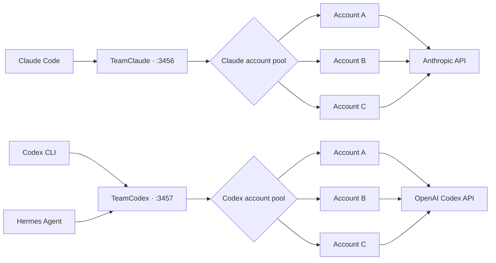

<p align="center">
  <strong>English</strong> ·
  <a href="README.ko.md">한국어</a> ·
  <a href="README.zh-CN.md">简体中文</a>
</p>

<p align="center">
  
</p>

<h1 align="center">TeamClaude · TeamCodex</h1>

<p align="center">
  <strong>One local proxy. Every coding account. No interrupted sessions.</strong>
</p>

<p align="center">
  Run Claude Code and OpenAI Codex CLI through independent multi-account pools<br>
  with quota-aware routing, instant failover, and a live terminal dashboard.
</p>

<p align="center">
  
  
  
  <a href="LICENSE"></a>
</p>

<p align="center">
  <a href="#quick-start"><strong>Quick Start</strong></a> ·
  <a href="#codex-multi-account-setup"><strong>Codex Setup</strong></a> ·
  <a href="#live-dashboard"><strong>Dashboard</strong></a> ·
  <a href="#how-it-works"><strong>Architecture</strong></a>
</p>

> [!NOTE]
> Claude and Codex use separate configs, ports, and account pools. Both proxies can stay online together, while Codex CLI and Hermes Agent keep using one stable local endpoint.

## Install

```bash
npm i -g teamcodex

teamcodex import          # pick up your existing Claude Code login
teamcodex codex import    # pick up your existing ~/.codex/auth.json
teamcodex server          # start the proxy, then `teamcodex run`
```

Both `teamcodex` and `teamclaude` are installed as commands and behave identically.

Prefer installing straight from the repository? `npm i -g github:sangrokjung/teamclaude`
works too and always tracks the default branch.

## Is this against the Terms of Service?

No. This does not share, resell, or pool accounts between people.

It routes **your own** authenticated sessions from **one machine**, which is exactly
what you would do by switching accounts by hand, minus the manual re-login. Every
request is signed with that account's own OAuth token, nothing is proxied on behalf
of third parties, and no credential ever leaves your machine.

It does not increase your quota and it does not bypass any limit. It stops the quota
you already paid for from expiring unused.

If you work in a team, every member still authenticates with their own subscription.
Using this to let several people share a single seat is not supported, and if a vendor
states that this class of tool is disallowed, this project will be changed or retired
accordingly.

## Credit and relationship to upstream

Fork chain: [KarpelesLab/teamclaude](https://github.com/KarpelesLab/teamclaude) →
[jung-wan-kim/teamclaude](https://github.com/jung-wan-kim/teamclaude) → this repository.
The fork badge at the top of this page shows the immediate parent, which is why it reads
jung-wan-kim rather than the original author.

This started as a fork of [KarpelesLab/teamclaude](https://github.com/KarpelesLab/teamclaude),
which does the Claude side very well and is worth using on its own. This fork went a
different direction when it needed **Codex (ChatGPT OAuth) account pooling**, which
upstream does not cover, plus a model fallback chain and network-level failover.
Upstream has features this fork does not, so pick whichever fits your setup.

## Live dashboard

<p align="center">
  
</p>

<p align="center"><sub>Actual TeamCodex TUI layout rendered with sanitized demo accounts.</sub></p>

## Why this exists

AI coding subscriptions have independent session and weekly limits. A long-running
terminal should not die just because one account reaches its cap. TeamClaude and
TeamCodex keep the client connected to a stable local endpoint and move new work to
the best available account automatically.

<table>
  <tr>
    <td width="50%">
      <strong>⚡ Seamless failover</strong><br>
      Switch accounts on quota, rate, network, or upstream failures without changing the client command.
    </td>
    <td width="50%">
      <strong>🧭 Quota-aware routing</strong><br>
      Spend the account whose weekly allowance resets soonest, preserving quota that would otherwise expire unused.
    </td>
  </tr>
  <tr>
    <td width="50%">
      <strong>🧠 Cache-friendly affinity</strong><br>
      Keep sequential turns on the same account while spreading concurrent overflow across the pool.
    </td>
    <td width="50%">
      <strong>🖥️ Operable by humans</strong><br>
      Inspect usage, switch accounts, disable unhealthy entries, and reorder priorities from the TUI.
    </td>
  </tr>
</table>

<details>
<summary><strong>What the QJC resilient-routing fork adds</strong></summary>

This is the `qjc/resilient-routing` fork (`1.2.3-qjc.x`) of
[jung-wan-kim/teamclaude](https://github.com/jung-wan-kim/teamclaude), based on
upstream `v1.2.3`.

- **Codex subscription pooling** with isolated official OAuth login sessions.
- **Top-tier weekly-window model routing** for model-scoped `7d_oi` quota.
- **Model fallback chains** through configurable `modelFallbacks`.
- **Bounded graceful shutdown** for reliable launchd/systemd restarts.
- **Network-error failover** with a bounded one-sweep retry budget.
- **Host CPU and RAM tracking** in status JSON, CLI output, and the TUI.
- **Hermes Agent compatibility** through the stable TeamCodex endpoint.

Install this fork with one command:

```bash
npm install -g teamcodex
```

From a local checkout, prefer
`npm pack && npm install -g ./karpeleslab-teamclaude-<version>.tgz`. A plain
`npm install -g <dir>` symlinks the checkout, which can break supervisors that
cannot read that path.

</details>

## Features

- **Use-or-lose account priority** — measures each account once at startup, then prioritizes the account whose weekly (7d) quota resets soonest (then soonest session reset, then lowest usage), so quota about to renew unused is drained first; re-evaluates every 5 minutes and switches immediately when the active account reaches the quota threshold (default 98%). Pin explicit ranks in the TUI (`o`) or via `teamclaude priority` for the accounts you want first — everything unranked stays on this automatic (`auto`) ordering
- **Codex subscription pooling** — `teamclaude codex ...` manages a separate ChatGPT OAuth account pool, injects each account's bearer token and `ChatGPT-Account-ID`, tracks the official `x-codex-primary-*` / `x-codex-secondary-*` windows, and fails exhausted requests over to the next Codex subscription
- **Instant failover on 429** — an exhausted account (token quota hit) is throttled for its `retry-after` (clamped to 1s–5m) and skipped; a rate/concurrency 429 (quota left but hit too fast) tries up to `rateLimitFailovers` alternate accounts so concurrent overflow spreads instead of erroring. A request-global 429 never throttles the fleet; after that bounded failover budget it enters continuity handling or passes through
- **Interactive TUI** — real-time dashboard with numbered account rows, color-coded quota bars showing usage %, reset countdowns, an activity log, and keyboard controls (switch, enable/disable, reorder accounts)
- **Manual account controls** — enable/disable accounts and pin an explicit account order from the TUI or CLI (`teamclaude disable|enable|priority`); a disabled account is excluded from rotation while its in-flight requests drain, and everything unranked stays on automatic use-or-lose ordering
- **Quota survives restarts** — general per-account quota state *and* the warm-up probe template are snapshotted to `<config>.quota.json` (every minute and on exit) and restored at startup. Model-scoped usage is deliberately re-measured instead of restored, so stale Fable data cannot block its own refresh path
- **Active warm-up** — after a (re)start the proxy probes eligible unmeasured accounts with a minimal request (reusing the last accepted request shape), so response-derived quota data populates without waiting for normal traffic to reach each account
- **Server lifecycle** — `teamclaude stop` / `teamclaude restart` cleanly stop or replace the running server from any terminal
- **OAuth token management** — automatically refreshes tokens nearing expiry and persists them to config; client token refreshes pass through untouched
- **Hot-reload accounts** — add accounts via `import` or `login` while the server is running, press **R** to pick them up; **R** also best-effort re-measures every idle account, including disabled accounts for display, and reports an honest `M/N`
- **Account deduplication** — detects duplicate accounts by UUID and keeps the most recent
- **Request logging** — optional full request/response logging for debugging
- **Host CPU / RAM tracking** — live host CPU%, 1/5/15-min load average, and RAM usage in the TUI header, `teamclaude status`, and the `/teamclaude/status` JSON (`host` field); measured with Node built-ins only
- **Zero dependencies** — uses only Node.js built-in modules

## Quick Start

Requires Node.js 18+.

```bash
# Install from npm
npm install -g teamcodex

# Add your first account (opens browser for OAuth)
teamclaude login

# Add a second account
teamclaude login

# Start the proxy
teamclaude server

# In another terminal, run Claude Code through the proxy
teamclaude run
```

> **Important:** a running proxy does not automatically capture a plain `claude`
> process. Start Claude Code with `teamclaude run`; otherwise it connects directly
> with its single logged-in account and cannot rotate when that account reaches a
> usage limit.

You can also import existing Claude Code credentials instead of logging in:

```bash
claude /login           # Log into an account in Claude Code
teamclaude import       # Import its credentials
```

## Codex Multi-account Setup

Codex uses a separate config (`~/.config/teamcodex.json`) and port (`3457`), so
the Claude and Codex proxies can run at the same time.

```bash
# Add accounts with isolated official Codex OAuth sessions.
# Each login uses a temporary CODEX_HOME, so its refresh token is owned only by
# TeamCodex after import and cannot race the normal ~/.codex/auth.json.
teamclaude codex login --name codex-pro-1
teamclaude codex login --name codex-pro-2

# Start the Codex proxy
teamclaude codex server

# In another terminal, run the interactive Codex CLI through the account pool
teamclaude codex run

# Non-interactive Codex commands are forwarded after `--`
teamclaude codex run -- exec "summarize this repository"
```

You can import the account currently logged into the official Codex CLI instead:

```bash
codex login
teamclaude codex import --name codex-pro-1
```

The isolated `teamclaude codex login` flow is recommended. A direct import copies
the same rotating refresh token used by `~/.codex/auth.json`; running plain
`codex` afterward can rotate that token outside the proxy. If that happens,
re-import the account or log it in again through `teamclaude codex login`.

`teamclaude codex run` starts an HTTP-only Responses provider that still uses
Codex's first-party ChatGPT auth path (`requires_openai_auth = true`) and
redirects `chatgpt_base_url` to the local proxy. This preserves the
subscription-only model catalog while preventing the default Responses
WebSocket from bypassing the HTTP proxy. The proxy discards the client's
incoming bearer token and account ID before forwarding, then injects the
selected pool account's credentials. The official Codex CLI must still have a
normal ChatGPT login to initialize its first-party auth path, but that
credential is never forwarded upstream by TeamCodex.

Codex usage is learned from response headers as traffic flows, so newly added
accounts show unmeasured quota until each account handles a request.

Common controls mirror the Claude pool:

```bash
teamclaude codex status
teamclaude codex accounts
teamclaude codex disable codex-pro-1
teamclaude codex enable codex-pro-1
teamclaude codex priority codex-pro-2 0
teamclaude codex restart
```

### Hermes Agent through TeamCodex

Keep the Codex proxy running and point Hermes at the stable local endpoint:

```yaml
# ~/.hermes/config.yaml
model:
  default: gpt-5.6-sol
  provider: openai-codex
  base_url: http://127.0.0.1:3457
```

If Hermes has `openai-codex` entries in its credential pool, set each entry's
`base_url` to the same local endpoint as well. Restart the Hermes gateway after
changing its configuration. Hermes keeps talking to one stable URL while
TeamCodex selects, refreshes, and rotates the upstream Codex account.

Run `teamclaude codex server` in a TTY to open the Codex account dashboard.
It uses the Codex config and port independently from the Claude dashboard, so
both proxies can stay online at the same time. For a non-interactive health
check, use `teamclaude codex status`.

## Adding Accounts

### OAuth Login (recommended)

The easiest way to add accounts — opens your browser for authentication:

```bash
teamclaude login
```

Uses the same OAuth flow as Claude Code. Auto-detects the account email and subscription tier. Logging in with the same account again updates its credentials.

You can add accounts while the server is running — press **R** in the TUI to reload.

### Import from Claude Code

If you already have Claude Code set up, you can import its credentials directly:

```bash
claude /login           # Log into an account in Claude Code
teamclaude import       # Import its credentials
```

Re-importing the same account updates its credentials. You can also import from a custom path:

```bash
teamclaude import --from /path/to/credentials.json
```

### API Key

For Anthropic API key accounts (billed via Console):

```bash
teamclaude login --api
```

## Usage

### Start the proxy server

```bash
teamclaude server
```

When running from a TTY, shows an interactive TUI with:
- Account table with **numbered rows** and session/weekly quota progress bars (usage % overlaid, plus a reset countdown when space allows); wide terminals add a third `Fbl` bar with the model-scoped weekly limit (the separate "Fable" weekly limit from Claude's usage UI). Ranked accounts are listed first, then the `auto` accounts in their actual drain order (weekly reset soonest first)
- Real-time activity log with request tracking
- Keyboard shortcuts (see below)

Falls back to plain log output when not a TTY (e.g. running as a service).

If the configured port is already in use — for example another TeamClaude proxy is already running — the server prints a clear message and exits instead of crashing with an unhandled error. Inspect the existing one with `teamclaude status`, or find the listener with `lsof -nP -iTCP:<port> -sTCP:LISTEN`.

#### TUI Keyboard Shortcuts

| Key | Action |
|-----|--------|
| `↑`/`↓` | Move the selection cursor over the accounts |
| `s` | Switch active account (to the selected one) |
| `e` | Enable / disable the selected account |
| `o` | Order the selected account: `↑`/`↓` move its rank, `a` resets the WHOLE order to `auto` (weekly-reset ordering), `c` clears just this account's rank |
| `a` | Add account (import or API key) |
| `d` | Delete an account (with confirmation) |
| `R` | Reload accounts from config and best-effort re-measure idle accounts — includes disabled accounts for display, skips busy and auth-error accounts, and reports an honest `M/N`; `Fbl` refreshes only when the probe template returns a model-scoped weekly header |
| `q` | Quit |

In selection mode, use `j`/`k` or arrow keys to navigate, `Enter` to confirm, `Esc` to cancel.

### Stop / restart the server

```bash
teamclaude stop       # SIGTERM the running server (escalates to SIGKILL if needed)
teamclaude restart    # stop the running server (if any) and start a fresh one
```

The running server is discovered via its state file (`<config>.server.json`) with a port-probe fallback, so `stop`/`restart` work from any terminal — even after a config port change. Quota state is restored on restart (see below), so a restart doesn't lose the dashboard.

> **Note:** if a Claude Code session is itself routed through the proxy (`teamclaude run`), running `teamclaude stop` *inside that session* severs its own API connection (`Unable to connect to API (ConnectionRefused)`). Stop or restart the proxy from a separate terminal instead — with `restart`, an in-flight session recovers on its own retries.

### Account order & manual controls

By default every account is on **`auto`** ordering (use-or-lose: weekly reset soonest is drained first). You can layer manual controls on top:

```bash
teamclaude disable <name>            # exclude from rotation (in-flight requests drain)
teamclaude enable <name>             # re-enable
teamclaude priority <name> <n|auto>  # pin explicit order (lower = preferred); "auto" clears it
```

In the TUI, `↑`/`↓` select an account, `e` toggles enable/disable, and `o` grabs the selected account into order mode: `↑`/`↓` move its rank, `a` resets the WHOLE order back to `auto`, `c` clears just that account's rank, `Enter`/`Esc` done. Ranked accounts render as `#1 #2 …` and are preferred first; everything unranked stays on the automatic ordering — so you can pin a few accounts and let the rest rotate.

CLI changes made while the server is running are picked up with **R** (reload) in the TUI or `teamclaude restart`.

### Run Claude Code through the proxy

```bash
teamclaude run
```

`teamclaude run` injects the proxy URL when the Claude Code process starts and
removes inherited `ANTHROPIC_API_KEY` / `ANTHROPIC_AUTH_TOKEN` values so Claude
Code keeps its Max/Pro OAuth subscription instead of silently preferring API
credits. A `CLAUDE_CODE_OAUTH_TOKEN`, when intentionally supplied, is preserved.
When `launchModel` is configured, `teamclaude run` also checks the proxy's latest
quota status before launch. If the configured top-tier model has measured quota
but no measured account can serve it, Claude Code is started directly on the
first configured fallback. For `claude-opus-4-8`, the launch argument is rendered
as `claude-opus-4-8[1m]`, so Claude Code's header and `/status` show the model and
context window actually serving the session. An explicit non-fallback `--model`
or `ANTHROPIC_MODEL` remains authoritative.
Starting or restarting TeamClaude later does **not** reroute an already-open
direct session, which can still show "out of usage credits" for its single
logged-in account while the proxy itself is healthy.

Exit that direct session and resume it through TeamClaude from the same working
directory:

```bash
teamclaude run -- --continue
# Or resume a specific conversation:
teamclaude run -- --resume <session-id>
```

Or manually set the environment:

```bash
eval $(teamclaude env)
claude
```

### Troubleshoot `ConnectionRefused`

`Unable to connect to API (ConnectionRefused)` means Claude Code could not reach
the local TeamClaude listener. Check the proxy from a separate terminal so the
diagnostic action does not terminate the session that depends on it:

```bash
teamclaude status
lsof -nP -iTCP:3456 -sTCP:LISTEN
teamclaude restart

# Resume the conversation through the recovered proxy
teamclaude run -- --continue
```

If the listener PID keeps changing, a supervisor such as launchd or systemd is
restarting the proxy. Inspect that supervisor's logs and health-check grace
period; repeated forced restarts create a no-listener window that surfaces as
`ConnectionRefused`. Do not run `teamclaude stop` from inside the affected
proxied Claude Code session.

### Host CPU / RAM line

`teamclaude status` prints a `Host:` line for the machine the *proxy* runs on:

```
Host:           CPU 43.3% (load 18.99 / 16 cores)   RAM 63.2GB/64.0GB (98.8%)
```

CPU% is measured between two status calls (the counters are cumulative), so the
very first call after a server start shows `-`. The TUI header shows the same
numbers compactly (`CPU 43% · RAM 98% · Port 3456 ▲`), turning yellow at 70%
and red at 90% — a host drowning in Claude Code sessions kills the proxy along
with everything else, so it gets a gauge right next to the quota bars. The raw
values (including the full 1/5/15-minute load-average triple and byte counts)
are in the `host` field of `GET /teamclaude/status`.

### Understand the quota numbers

`teamclaude status` and the TUI show the latest quota headers observed by the
proxy, not an on-demand account usage query. They can lag usage spent in another
Claude Code session or on another device. Pressing **R** best-effort re-probes
eligible idle accounts and refreshes only the headers returned by the captured
probe template. Disabled accounts are included for display without being
re-enabled; busy and auth-error accounts are skipped. `Fbl` can remain stale
until a top-tier request shape returns the model-scoped weekly header.

Current Claude Code OAuth builds also expose their own account usage view. It
uses an OAuth-only implementation surface rather than a documented general
Anthropic API, so TeamClaude does not depend on it for routing. When the views
disagree, treat Claude Code's account usage view as the live account check and
TeamClaude as the proxy's last observation.

Every applicable window matters. A `Fbl` bar below 100% does not mean Fable can
run when the general 5-hour or 7-day window is already at `switchThreshold`.
For example, 59% Fable usage with 99% 5-hour usage is unavailable at the default
98% threshold until the 5-hour window resets.

The per-account `Total: … tokens` counter folds **all three input families** —
`input_tokens` (uncached prompt), `cache_creation_input_tokens`, and
`cache_read_input_tokens` — plus output tokens. Anthropic's `input_tokens`
excludes the prompt cache, and Claude Code keeps almost the whole context cached,
so counting `input_tokens` alone made the total accumulate only a few hundred
tokens per request; `sumInputTokens` in `server.js` sums the cache fields so the
displayed total reflects real volume (qjc fork).

> **QJC self-lock guard:** `modelWeekly` is response-derived. The fork does not
> restore it after restart or use it to pre-block account selection; the next
> top-tier request refreshes the value, and a live model-quota 429 drives scoped
> failover or `modelFallbacks`. If a global installation carries additional
> local patches, validate or reapply them in the service startup path because an
> npm or Node upgrade can replace globally installed source files.

### Other commands

```bash
teamclaude accounts          # List accounts with subscription tier and token status
teamclaude accounts -v       # Also show token expiry times
teamclaude status            # Show the proxy's last-observed quota status (requires running server)
teamclaude stop              # Stop the running proxy server
teamclaude restart           # Stop the running server and start a fresh one
teamclaude remove <name>     # Remove an account
teamclaude disable <name>    # Disable an account (excluded from rotation)
teamclaude enable <name>     # Re-enable a disabled account
teamclaude priority <name> <n|auto>  # Pin selection order (lower = preferred; "auto" clears)
teamclaude api <path>        # Call an API endpoint with account credentials
teamclaude help              # Show all commands
```

### Request logging

Log full request/response details to a directory (one file per request):

```bash
teamclaude server --log-to /tmp/requests
```

## Configuration

Config is stored at `~/.config/teamclaude.json` (or `$XDG_CONFIG_HOME/teamclaude.json`). A random proxy API key is generated on first use.

Override the config path with `TEAMCLAUDE_CONFIG`:

```bash
TEAMCLAUDE_CONFIG=./my-config.json teamclaude server
```

### Config format

```json
{
  "proxy": {
    "port": 3456,
    "apiKey": "tc-auto-generated-key"
  },
  "upstream": "https://api.anthropic.com",
  "switchThreshold": 0.98,
  "accounts": [
    {
      "name": "user@example.com",
      "type": "oauth",
      "accountUuid": "...",
      "accessToken": "sk-ant-oat01-...",
      "refreshToken": "sk-ant-ort01-...",
      "expiresAt": 1774384968427,
      "enabled": true,
      "priority": 0
    }
  ]
}
```

| Field | Description |
|-------|-------------|
| `proxy.port` | Local port the proxy listens on |
| `proxy.apiKey` | API key clients use to authenticate with the proxy |
| `upstream` | Upstream API base URL |
| `switchThreshold` | Quota utilization (0–1) at which an account is considered full and skipped |
| `reevalIntervalMs` | How often (ms) to re-rank accounts by priority while the active one is healthy (optional, default `300000` = 5 min). Set to `0` to disable the timer entirely — the active account then only changes when it becomes unavailable or via per-request 429 failover |
| `activeWarmup` | Probe unmeasured accounts after a restart to populate quota (optional, default `true`) |
| `warmupIntervalMs` | How often (ms) the active warm-up re-probes accounts whose quota window reset (optional, default `300000` = 5 min; `0` = startup-only) |
| `continuityMode` | Hold requests in the proxy while quota or global rate limits recover instead of returning 429 (optional, default `true`) |
| `continuityMaxSleepMs` | Maximum interval between continuity probes (optional, default `30000`) |
| `rateLimitFailovers` | Alternate accounts tried before treating a non-quota 429 as global (optional, default `1`) |
| `accounts[].enabled` | Set `false` to exclude the account from rotation (optional, default `true`) |
| `accounts[].priority` | Explicit selection rank (lower = preferred first; optional — unset means automatic use-or-lose ordering) |
| `modelFallbacks` | Fork only — per-model fallback chains applied after live model-quota exhaustion reaches all eligible accounts or the bounded unlabeled-429 failover budget is exhausted (optional, default `{}`; see below) |
| `launchModel` | Fork only — preferred Claude Code model for `teamclaude run`; when its measured top-tier quota is unavailable, launch directly on the first `modelFallbacks` target so the Claude Code model display matches routing (optional, default `null`) |

### Model fallbacks (fork)

```json
{
  "launchModel": "claude-fable-5",
  "modelFallbacks": {
    "claude-fable-5": ["claude-opus-4-8"],
    "claude-mythos-5": ["claude-opus-4-8"]
  }
}
```

When live model-tier exhaustion (`7d_oi`) reaches all eligible accounts, selection has no eligible account, or repeated unlabeled 429s exhaust `rateLimitFailovers`, the proxy rewrites the request body's `model` to the next entry of the chain and retries under normal routing instead of immediately passing the 429 through. Semantics:

- The chain is resolved **once per request from the original model** (fallbacks of fallbacks are not followed) and consumed in order; when it runs dry, the pre-existing 429/continuity behavior applies unchanged.
- Keys and targets must be **plain API model IDs**. A client-side bracket suffix (`claude-fable-5[1m]` — the API rejects such IDs as `not_found_error`) matches its suffix-stripped entry.
- `launchModel` keeps those API IDs plain in config. Only the Claude Code launch
  display adds `[1m]` to Opus 4.8; Claude Code strips that suffix before sending
  the request to the proxy.
- Fallback runs **before** a continuity-mode sleep on purpose: rewriting to a served model beats sleeping until a weekly reset.
- A genuinely global/IP rate limit just 429s the fallback model too and falls through to the old behavior — no state is poisoned.
- Mind quality expectations when composing chains: a background agent may be fine falling all the way to a small model, but an interactive session usually is not — this fork's author runs `fable → opus` only, preferring a surfaced 429 (client retries/waits) over silently degrading below Opus.

## How It Works



1. Claude Code connects to the local proxy instead of `api.anthropic.com`
2. The proxy selects the active account and forwards requests with that account's credentials
3. OAuth tokens expiring within 5 minutes are automatically refreshed and persisted to config
4. Rate limit headers from the API (`anthropic-ratelimit-unified-*`) track the proxy's last-observed session (5h) and weekly (7d) quota utilization. Model-scoped weekly windows (`7d_oi` — the separate Fable/Mythos weekly limit) are re-measured after restart and classify live top-tier quota 429s without globally throttling accounts that still serve Opus/Sonnet/Haiku
5. **Cold-start warm-up**: quota is only known after a request flows through an account, so at startup the proxy first routes requests to any unmeasured account until every account has been measured once. An **active warm-up** additionally probes unmeasured accounts directly — a minimal 1-token request reusing the shape of the first real request — so the whole fleet is measured within seconds of the first post-restart request instead of waiting for traffic to reach each account (`activeWarmup: false` disables it). Then account selection becomes **use-or-lose**: among accounts still under the threshold, it prefers the one whose weekly (7d) quota resets soonest (tie-breaks: soonest session reset, then lowest usage), so quota about to renew unused is drained first. Explicitly ranked accounts (`priority` / TUI `o`) are preferred before all of that; disabled accounts are excluded entirely. The active account stays sticky to keep its prompt cache warm; priority is re-evaluated every `reevalIntervalMs` (default 5 min; set `0` to disable timer-based switching), and on reaching the threshold it switches immediately to the next-highest-priority account
6. On a 429 the proxy classifies it:
   - **Account-quota exhaustion** (upstream reports the account is over its limit) → marks that account rate-limited for its `retry-after` (clamped to 1s–5m) and immediately re-dispatches to the next available account. If every account is throttled it returns 429 with a computed `retry-after`. (This also keeps cold-start warm-up fast: an exhausted account is skipped in one round-trip.)
   - **Rate/concurrency or transient 429** → the request tries a bounded number of alternate accounts. If the limit appears global, continuity mode opens a shared cooldown and retries internally instead of multiplying the request across the fleet or surfacing 429 to Claude Code.
   - **Requested-model dead end** (fork) → after live model-quota exhaustion reaches all eligible accounts or the unlabeled-429 failover budget is exhausted, a configured `modelFallbacks` chain rewrites the request to the next model before any 429 is surfaced or continuity sleep starts.
7. Transient network errors (connection reset, timeout) fail over to another account before any response bytes are sent. Mid-stream errors, or a failure with no alternate account left, close the connection so the client can retry
8. If all accounts are exhausted, continuity mode holds the request and polls using the computed account/model reset time. Setting `continuityMode: false` restores the legacy 429 response with `retry-after`.
9. **Quota survives restarts**: the server snapshots general per-account quota/throttle state plus the committed warm-up probe template to `<config>.quota.json` (every minute and on exit), so TUI **R** works before fresh traffic arrives. A restored template is provisional and the first freshly accepted request shape replaces it. Model-scoped weekly values are intentionally discarded on import and re-measured from live traffic so stale Fable data cannot self-lock its refresh path
10. Client token refresh requests (`/v1/oauth/token`) are relayed to upstream untouched — the proxy and client manage their own token lifecycles independently

## License

MIT
