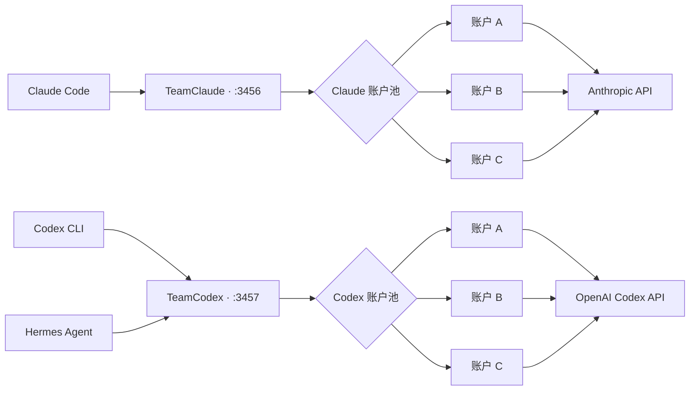

<p align="center">
  <a href="README.md">English</a> ·
  <a href="README.ko.md">한국어</a> ·
  <strong>简体中文</strong>
</p>

<p align="center">
  
</p>

<h1 align="center">TeamClaude · TeamCodex</h1>

<p align="center">
  <strong>一个本地代理，连接所有编程账户，让会话不中断。</strong>
</p>

<p align="center">
  通过相互独立的多账户池运行 Claude Code 与 OpenAI Codex CLI。<br>
  支持配额感知路由、即时故障转移和实时终端仪表盘。
</p>

<p align="center">
  
  
  
  <a href="LICENSE"></a>
</p>

<p align="center">
  <a href="#快速开始"><strong>快速开始</strong></a> ·
  <a href="#codex-多账户配置"><strong>Codex 配置</strong></a> ·
  <a href="#实时仪表盘"><strong>仪表盘</strong></a> ·
  <a href="#工作原理"><strong>架构</strong></a>
</p>

> [!NOTE]
> Claude 与 Codex 分别使用独立的配置文件、端口和账户池。两个代理可以同时在线，Codex CLI 与 Hermes Agent 始终连接同一个稳定的本地地址。

## 安装

```bash
npm i -g teamcodex

teamcodex import          # 读取已有的 Claude Code 登录
teamcodex codex import    # 读取已有的 ~/.codex/auth.json
teamcodex server          # 启动代理，然后执行 `teamcodex run`
```

命令只有 `teamcodex` 一个。本包刻意不安装 `teamclaude` 二进制，以免与同名的上游包冲突。

想直接从仓库安装也可以：`npm i -g github:sangrokjung/teamclaude`，这种方式始终跟随默认分支。

## 关于使用条款

**本项目仅用于管理你自己拥有的账号，不支持也不鼓励账号共享、代充或转售。**

它做的事情，就是把你手动切换自己账号的动作自动化。所有请求都在你自己的机器上发出，
每个请求都带该账号自身的 OAuth token，也不会为第三方做任何中转。凭证保存在本地，
只会发往官方 API，与 CLI 原本的发送目标完全相同，第三方无法接触到它。

它不会增加你的额度，也不会绕过任何限制。它只是让你已经付费的额度不至于白白过期。

顺带一提，Claude Code 自身的 `/extra-usage` 流程在触及限额时，就会提示你登录**自己名下的另一个账号**。
"换成我自己的另一个账号继续工作"本来就是官方客户端主动提供的操作，本项目只是把这个切换自动化，
省去手动点击。

如果是团队使用，每个成员仍然用自己的订阅登录。多人共用一个席位不在支持范围内。
如果官方明确表示不允许这类工具，本项目会相应调整功能或停止维护。

## 与上游项目的关系

Fork 谱系：[KarpelesLab/teamclaude](https://github.com/KarpelesLab/teamclaude) →
[jung-wan-kim/teamclaude](https://github.com/jung-wan-kim/teamclaude) → 本仓库。
页面顶部的 fork 标识只显示直接上级，所以显示的是 jung-wan-kim 而不是原作者。

本项目 fork 自 [KarpelesLab/teamclaude](https://github.com/KarpelesLab/teamclaude)。
上游在 Claude 侧的实现非常扎实，值得单独使用。这个分支是因为需要**Codex（ChatGPT OAuth）
多账号池**才走了另一条路，上游并未覆盖这部分，此外还加了模型降级链和网络层故障转移。
上游也有本分支没有的功能，按自己的场景选择即可。

## 实时仪表盘

<p align="center">
  
</p>

<p align="center"><sub>使用脱敏演示账户渲染的真实 TeamCodex TUI 布局。</sub></p>

## 为什么需要它？

AI 编程订阅的会话限额和每周限额按账户分别计算。某个账户达到限额时，
长时间运行的终端不应该因此中断。TeamClaude 与 TeamCodex 让客户端始终
连接同一个本地地址，并自动把新请求切换到最合适的可用账户。

<table>
  <tr>
    <td width="50%">
      <strong>⚡ 无缝故障转移</strong><br>
      遇到配额、速率、网络或上游故障时，无需修改客户端命令即可切换账户。
    </td>
    <td width="50%">
      <strong>🧭 配额感知路由</strong><br>
      优先使用每周配额最早重置的账户，避免即将刷新却尚未使用的额度被浪费。
    </td>
  </tr>
  <tr>
    <td width="50%">
      <strong>🧠 缓存友好的连接亲和性</strong><br>
      连续对话保持在同一账户上，仅在并发溢出时把请求分散到其他账户。
    </td>
    <td width="50%">
      <strong>🖥️ 可人工操作</strong><br>
      可在 TUI 中查看用量、切换账户、禁用异常账户并调整优先级。
    </td>
  </tr>
</table>

## 主要功能

- **Use-or-lose 优先级** — 优先使用每周配额最早重置的账户。
- **Codex 订阅账户池** — 单独管理 ChatGPT OAuth 账户并追踪官方 Codex 用量响应头。
- **429 即时故障转移** — 暂时排除配额耗尽的账户，并把请求发送到下一个账户。
- **连续性模式** — 所有账户暂时受限时，在代理内部等待重置，而不是立即让客户端失败。
- **连接亲和性** — 同一终端的连续请求尽量停留在同一账户，保留 prompt cache。
- **并发请求分散** — 超出单账户并发上限的流量自动分散到其他账户。
- **模型 fallback** — 所有账户都无法使用指定模型时，切换到配置的备用模型。
- **实时 TUI** — 显示账户状态、会话与每周用量、重置时间以及 CPU、内存。
- **手动账户控制** — 通过 CLI 或 TUI 执行 enable、disable、switch 和 priority。
- **重启后恢复状态** — 将用量和 throttle 状态保存在独立的 quota 文件中。
- **Active warm-up** — 复用真实请求格式，以最小请求快速测量各账户的用量。
- **OAuth 自动刷新** — 自动刷新即将过期的认证信息，并通过后台定期扫描刷新闲置和已禁用账户，避免 refresh 链失效。
- **安全的内部重试边界** — 只在代理内部重试可安全重发的请求；结果不确定的 POST 不做隐藏重发，而是返回可重试的错误。
- **资源上限** — 对请求、响应缓冲区和等待时间设置上限，过载时代理也不会卡死。
- **零运行时依赖** — 仅使用 Node.js 内置模块。

## 快速开始

需要 Node.js 18 或更高版本。

```bash
# 安装
npm install -g teamcodex

# 添加 Claude 账户——会打开浏览器 OAuth
teamclaude login
teamclaude login

# 启动 Claude 代理
teamclaude server

# 在另一个终端中运行 Claude Code
teamclaude run
```

> [!IMPORTANT]
> 即使代理正在运行，普通的 `claude` 命令也不会自动使用代理。若要启用账户自动切换，请始终通过 `teamclaude run` 启动。
> `teamclaude run` 会在代理缺失时自动启动后台 supervisor。即使 proxy worker 异常退出，public listener 仍会保持，并自动启动新的 worker。

也可以导入 Claude Code 当前的登录信息：

```bash
claude /login
teamclaude import
```

## Codex 多账户配置

Codex 使用 `~/.config/teamcodex.json` 和默认端口 `3457`。
Claude 代理默认使用端口 `3456`，因此两个服务器可以同时运行。

```bash
# 在彼此隔离的 CODEX_HOME 中执行官方 Codex OAuth
teamclaude codex login --name codex-pro-1
teamclaude codex login --name codex-pro-2

# 启动 Codex 代理和仪表盘
teamclaude codex server

# 在另一个终端中运行 Codex CLI
teamclaude codex run

# 非交互式运行
teamclaude codex run -- exec "summarize this repository"
```

也可以导入当前登录到官方 Codex CLI 的账户：

```bash
codex login
teamclaude codex import --name codex-pro-1
```

推荐使用 `teamclaude codex login`。该流程在临时 `CODEX_HOME` 中完成登录，
可以避免 TeamCodex 与普通 `~/.codex/auth.json` 同时轮换同一个 refresh
token 而发生冲突。

### Codex 账户控制

```bash
teamclaude codex status
teamclaude codex accounts
teamclaude codex disable codex-pro-1
teamclaude codex enable codex-pro-1
teamclaude codex priority codex-pro-2 0
teamclaude codex restart
```

## 连接 Hermes Agent

启动 TeamCodex 后，把 Hermes 的 Codex provider 指向本地代理：

```yaml
# ~/.hermes/config.yaml
model:
  default: gpt-5.6-sol
  provider: openai-codex
  base_url: http://127.0.0.1:3457
```

如果 Hermes 的 credential pool 中已有 `openai-codex` 条目，也请把每个条目的
`base_url` 设置为同一个本地地址。修改配置后重启 Hermes gateway。Hermes
只连接一个固定地址，实际账户的选择、刷新与切换均由 TeamCodex 负责。

## 添加账户

### OAuth 登录

```bash
teamclaude login
```

### 从 Claude Code 导入

```bash
teamclaude import
teamclaude import --name work
```

### API key 账户

```bash
teamclaude api --name production
```

## 服务器与仪表盘

```bash
teamclaude server
teamclaude status
teamclaude accounts
teamclaude stop
teamclaude restart
```

在 TTY 中运行 `teamclaude server` 或 `teamclaude codex server` 时，
会打开全屏仪表盘。

| 按键 | 操作 |
|---|---|
| `↑` / `↓` | 选择账户 |
| `s` | 切换到所选账户 |
| `e` | 启用或禁用所选账户 |
| `o` | 进入优先级移动模式 |
| `a` | 将全部优先级恢复为自动模式 |
| `c` | 清除所选账户的固定优先级 |
| `d` | 删除账户 |
| `R` | 重新加载配置并重新测量用量 |
| `q` | 退出 |

## 基础配置

Claude 配置文件为 `~/.config/teamclaude.json`，Codex 配置文件为
`~/.config/teamcodex.json`。实际文件以 `0600` 权限保存。

```json
{
  "proxy": {
    "host": "127.0.0.1",
    "port": 3456
  },
  "upstream": "https://api.anthropic.com",
  "switchThreshold": 0.98,
  "reevalIntervalMs": 300000,
  "maxConcurrentPerAccount": 3,
  "sessionAffinity": true,
  "continuityMode": true,
  "activeWarmup": true,
  "accounts": []
}
```

| 配置项 | 说明 |
|---|---|
| `switchThreshold` | 将账户视为已满的使用率阈值 |
| `reevalIntervalMs` | 重新评估 sticky 账户优先级的间隔 |
| `maxConcurrentPerAccount` | 单个账户的最大并发上游请求数 |
| `sessionAffinity` | 将同一连接保持在原账户 |
| `continuityMode` | 全部受限时在内部等待，而不是返回 429 |
| `activeWarmup` | 通过最小请求预先测量账户用量 |
| `accounts[].enabled` | 设为 `false` 时从轮换中排除账户 |
| `accounts[].priority` | 数字越小，固定优先级越高 |
| `modelFallbacks` | 各模型的备用模型链 |
| `streamRecovery` | 按事件边界转发 SSE，并把中断的流收尾为可重试的错误 |
| `tokenRefreshIntervalMs` | 闲置账户 OAuth 刷新扫描间隔（`0` = 关闭） |

缓冲区、超时上限等完整配置项请参阅[英文 README](README.md#configuration)。

## 工作原理



1. 客户端连接本地代理，而不是直接连接服务商 API。
2. 代理从可用账户中选择优先级最高的账户。
3. 距离过期不足 5 分钟的 OAuth token 会在请求前自动刷新。
4. 代理从响应头学习会话、每周和模型级用量及其重置时间。
5. 新启动的服务器会优先轮询尚未测量的账户。
6. 配额型 429 会立即排除当前账户并切换到其他账户。
7. 速率或并发型 429 只进行有限次数的分散，不会污染账户状态。
8. 网络错误或不完整的 SSE 流，只有可安全重发的请求才会在内部换账户重试；结果不确定的 POST 不做隐藏重发，而是返回可重试的错误。
9. 所有账户受限时，连续性模式会等待最近的重置时间。
10. 普通用量状态会在重启后恢复，模型级用量则通过真实流量重新测量。

## 安全提示

- 请勿把包含真实认证信息的配置文件提交到 Git。
- 远程客户端必须通过 `x-api-key` 认证。
- 默认只信任来自 localhost 的本地请求。
- 启用请求日志时，认证信息仍会被遮罩。

## 许可证

MIT
